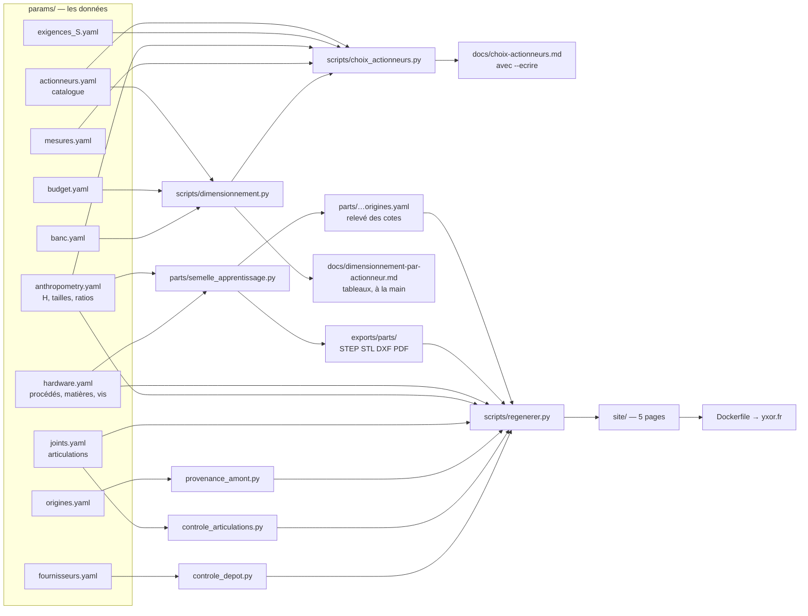
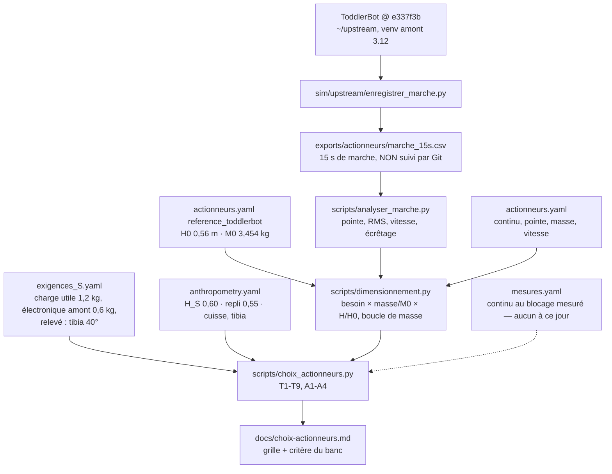

# État des lieux factuel du dépôt YXOR — 2026-10-01

**Établi le 2026-10-01, à partir de 18 h 10** (`date`), au commit `78a1819`
(étiquette `apres-refonte-2026-10-01`). Écrit en **lecture seule** : seuls
ce rapport et une ligne de journal sont écrits. Après toutes les
commandes ci-dessous, `git status` est vide (le relevé de la semelle se
régénère à l'identique).

**Ce rapport donne des faits, pas une synthèse.** Demande de Jeremy
(2026-10-01, ses mots) : « revoir et mieux assimiler et mieux comprendre
tout ce que l'on a réalisé jusqu'à présent […] ce qui a été implémenté ou
non et pourquoi, ce qui a été décidé ou non et pourquoi, les choses que
l'on a remises à plus tard, les questions et pistes de réflexion ».

**Marques employées :**

- **EXÉCUTÉ** : lancé ici, vu marcher ;
- **PRÉSENT** : le code existe, il n'a pas été lancé ici ;
- **ABSENT** : rien dans le dépôt.

Ce qui n'est pas établi est écrit « non établi ».

---

## 1 — Ce qui marche, vérifié

Toutes les commandes sont lancées avec `.venv/bin/python`, depuis la
racine du dépôt.

| Commande | Ce qu'elle fait, simplement | Ce qu'elle produit | Sortie (extraits) | Marque |
| --- | --- | --- | --- | --- |
| `scripts/regenerer.py` | Reconstruit tout : la pièce, puis le site, puis passe les contrôles | `exports/parts/` (STEP, STL, DXF, plan A4 en PDF), `site/` (5 pages), code de retour 0 | « 1 pièce(s) » ; « 1123 valeurs d'origine ToddlerBot dans 6 fichiers » ; « règle 4 : 179 fichiers suivis, aucun binaire » ; « noms d'articulations — moteurs … 30 / 30 » ; « rayon intérieur minimal conforme sur 6 réglages » ; « structure HTML : 5 pages, balises équilibrées » ; « Terminé en 10.3 s » | EXÉCUTÉ |
| `-m unittest discover -s tests -v` | Lance les 23 tests | — | « Ran 23 tests in 23.147s / OK » (en 24 s environ) | EXÉCUTÉ |
| `scripts/dimensionnement.py` | Calcule, pour chaque classe d'actionneur, la taille maximale du robot qu'elle porte, à marge 1,5 | Un tableau au terminal ; avec `--markdown`, les tableaux de `docs/dimensionnement-par-actionneur.md` | « 35 configurations, marge 1.5 (décidée : fiche 0051) » ; contrôle de cohérence ToddlerBot « attendu 0.56 m -> H_max 0,560 m » ; « homogène RobStride RS00 H_max 0,754 m masse 10,67 kg » ; « [S_rs00_rs05] H_max 0,647 m » | EXÉCUTÉ |
| `scripts/choix_actionneurs.py` | Dresse la grille PASS / FAIL / UNKNOWN / TESTED des candidats de S à H_S = 0,60 m | Un tableau au terminal ; avec `--ecrire`, `docs/choix-actionneurs.md` | « H_S = 0.6 m, charge 1.2 kg, marge 1.5, k_bas 0.619 » ; RS00 PASS de T1 à T9 ; « RS00, charge 1.2 kg : masse 7.80 kg » ; « banc, critère du § 4 : aucune mesure au blocage du RS00, pas de verdict » | EXÉCUTÉ |
| `scripts/provenance_amont.py` | Compte les valeurs du dépôt qui viennent de ToddlerBot | Une ligne de compte, code de retour 0 | « 1123 valeurs d'origine ToddlerBot dans 6 fichiers — params/anthropometry.yaml 1, params/joints.yaml 364, params/upstream_joints.generated.yaml 715, params/ckpts.manifest.yaml 40, params/actionneurs.yaml 3, parts/semelle_apprentissage.origines.yaml 0 » | EXÉCUTÉ |
| `scripts/controle_articulations.py` | Vérifie que les noms d'articulations sont les mêmes partout | Une ligne de compte, code de retour 0 | « moteurs joints.yaml / actionneurs MJCF : 30 / 30 ; articulations … : 30 / 30 ; … série de simulation : 12 actionneurs » | EXÉCUTÉ |
| `scripts/controle_depot.py` | Vérifie qu'aucun binaire n'est suivi par Git, et le registre des fournisseurs | Une ligne de compte | « règle 4 : 179 fichiers suivis, aucun binaire, provenances conformes, 6 journaux bien datés » | EXÉCUTÉ |
| `parts/semelle_apprentissage.py` | Dessine la semelle d'apprentissage et vérifie ses cotes | STEP, STL, DXF, plan A4 dans `exports/parts/` ; relevé `parts/semelle_apprentissage.origines.yaml` (8 cotes) | « taille L, réglage cutter_cartonplume_5 » ; longueur 138,06 mm = H × ratio ; 8 contrôles « OK », dont « contour analytique conforme au noyau CAO (0.0024 mm <= 0.05) » | EXÉCUTÉ |
| Site `https://yxor.fr` | Projection du dépôt, reconstruite à chaque déploiement | — | `curl` : HTTP 200 ; empreinte affichée `e0123be05d` = `scripts/empreinte.py` | EXÉCUTÉ (lecture) |
| Dépôt GitHub | — | — | `gh repo view` : `"visibility":"PUBLIC"` | EXÉCUTÉ (lecture) |
| Simulateur du navigateur (`web/simulateur.js`) | Permet de changer `H` et les ratios sur la page d'une pièce, et de voir les cotes se recalculer | — | **Non vérifié, à tester par Jeremy.** Aucun navigateur n'est disponible ici (le script de test des pages, qui demandait Chromium, est archivé : `archive/scripts/verifier_pages.py`). Le dépôt le dit aussi : « Le simulateur n'a jamais été vu tourner dans un navigateur » (`docs/decisions.md:150`). | PRÉSENT |

**La semelle est dessinée à la taille L (0,90 m), pas à S.** C'est la
valeur par défaut : `parts/semelle_apprentissage.py:207`, `--taille`
avec `default="L"` et l'aide « L = 0,90 m, l'ancien palier P2 (fiche
0055) ».

**Ce qui existe, non lancé ici (PRÉSENT)** :

- `sim/upstream/enregistrer_marche.py` et `replay_policy.py` : venv
  amont, Python 3.12 ;
- `scripts/estimation_thermique.py` (lancé pendant R6, pas pendant cet
  état des lieux) ;
- `scripts/pertes_cuivre.py`, `scripts/import_upstream_limits.py`,
  `scripts/ckpts_backup.py`, `scripts/ratios_ansur.py` (couvert par un
  test), `scripts/source.py` ;
- `sim/render.py` et `sim/view.py`.

**La série de marche** lue par le dimensionnement,
`exports/actionneurs/marche_15s.csv` (963 297 octets, modifiée le
2026-09-30 à 17 h 09), est sur le disque mais **pas dans Git** :
`exports/` est ignoré.

---

## 2 — La chaîne complète

### 2.1 Des données au site

`regenerer.py` n'appelle **ni** `dimensionnement.py --markdown`, **ni**
`choix_actionneurs.py --ecrire`. Les deux documents engendrés se
régénèrent à la main (§ 7).

### 2.2 De la marche ToddlerBot à la grille de S

---

## 3 — Les fichiers de `params/`

Les lecteurs indiqués sont ceux qui **chargent** le fichier
(`read_text`, `safe_load`, ou un chemin `REPO / "params" / …`). Les
simples mentions en commentaire ne comptent pas.

| Fichier | Ce qu'il contient | Qui le lit | D'où viennent ses valeurs |
| --- | --- | --- | --- |
| `anthropometry.yaml` | `H` de référence (0,56 m), les tailles S/M/L/XL, les ratios de longueur et de masse | `parts/semelle_apprentissage.py:79`, `scripts/regenerer.py:335`, `scripts/choix_actionneurs.py:39`, `scripts/ratios_ansur.py` | `H` : ToddlerBot (amont, 1 valeur). Tailles : choix du projet (fiches 0048, 0065). Longueurs : ANSUR II, recalculées depuis les données brutes. Masses de segment : Winter (littérature). |
| `hardware.yaml` | Machines, procédés, matériaux, matières, réglages de fabrication, vis, roulements | `scripts/procedes.py:29`, `parts/semelle_apprentissage.py:80`, `scripts/regenerer.py:334` | Choix du projet, fiches constructeur (vis), mesures (carton, via `mesures.yaml`) |
| `joints.yaml` | Les articulations (nom, axe, butées, moteurs, transmission) | `scripts/regenerer.py:336`, `scripts/controle_articulations.py`, `scripts/import_upstream_limits.py` | ToddlerBot (amont, 364 valeurs), réconcilié ; fonctions et convention : projet |
| `upstream_joints.generated.yaml` | Extrait engendré du MJCF ToddlerBot : actionneurs, articulations, bielles | `scripts/controle_articulations.py` ; écrit par `scripts/import_upstream_limits.py:62` | ToddlerBot (amont, 715 valeurs), engendré |
| `ckpts.manifest.yaml` | Manifeste des poids de politique ToddlerBot sauvegardés hors Git | `scripts/ckpts_backup.py:45` | ToddlerBot (amont, 40 valeurs) |
| `actionneurs.yaml` | Le catalogue des candidats, les faits du comparatif de S, les familles S → M → L, la marge, la référence ToddlerBot, la collecte des critères manquants | `scripts/dimensionnement.py:83`, `scripts/choix_actionneurs.py` (via dimensionnement), `scripts/estimation_thermique.py:101`, `scripts/controle_articulations.py` | Constructeurs et revendeurs, chaque valeur avec sa source et sa date ; 3 valeurs amont ; marge (choix du projet, fiche 0051) |
| `exigences_S.yaml` | Exigences T1-T9 et A1-A4, charge utile, masse de l'électronique amont, hypothèses du relevé | `scripts/choix_actionneurs.py:38`, `scripts/controle_articulations.py` | Choix du projet (PROPOSÉ) ; article ToddlerBot arXiv 2502.00893v1 pour l'électronique (littérature) |
| `budget.yaml` | Méthode de coût, taux de TVA, change, électronique, phases (banc, jambes v1, haut du corps v2) | `scripts/dimensionnement.py:84` | Prix revendeurs (datés), taux BCE, taux légaux ; imprévus de 15 % : « choix provisoire de l'assistant » (`budget.yaml:37`) |
| `banc.yaml` | Configuration du banc (`rs00_x2`, non décidée), seuil thermique | `scripts/dimensionnement.py:85`, `scripts/estimation_thermique.py:102` | Choix du projet (proposé) |
| `mesures.yaml` | Les actes de mesure (5 entrées : masses de carton…) | `scripts/choix_actionneurs.py:40` (critère du banc) | Mesures (balance de cuisine, 2026-09-29) |
| `origines.yaml` | Les règles qui désignent les valeurs d'origine ToddlerBot | `scripts/provenance_amont.py:34` | Déclaration du projet |
| `fournisseurs.yaml` | Registre des documents fournisseurs obtenus (37 entrées, six champs) | `scripts/controle_depot.py:112` | Registre du projet (fiche 0030) |
| `sources.yaml` | Registre des sources lues, avec leur état de lecture | `scripts/source.py:62` | Registre du projet (fiche 0040) |

---

## 4 — Implémenté / non implémenté

| Élément | État | Preuve | Raison écrite dans le dépôt |
| --- | --- | --- | --- |
| Pièce d'apprentissage (semelle) | EXÉCUTÉ | § 1 | — |
| Plan de découpe A4, DXF, STEP, STL | EXÉCUTÉ | § 1, `exports/parts/` | — |
| Site statique et déploiement | EXÉCUTÉ | HTTP 200, empreinte = dépôt | — |
| Dimensionnement inversé | EXÉCUTÉ | § 1 | — |
| Grille de S et critère du banc | EXÉCUTÉ | § 1 ; `tests/test_critere_banc.py` | — |
| Contrôles (règle 4, provenance amont, noms, rayon) | EXÉCUTÉ | § 1 | — |
| Simulation de la marche ToddlerBot | PRÉSENT (série produite le 2026-09-30) | `sim/upstream/enregistrer_marche.py` ; `exports/actionneurs/marche_15s.csv` | — |
| Simulateur dans le navigateur | PRÉSENT, jamais vu tourner | `web/simulateur.js` ; `docs/decisions.md:150` | « La pièce à simuler après la semelle est à choisir » (`docs/decisions.md:168`) |
| **Pièces de jambe** | ABSENT | `parts/` : une seule pièce | Proposée comme étape suivante, non décidée (`README.md:46`). S n'est décidé que depuis le 2026-10-01 (fiche 0065). |
| **Couche logicielle d'articulation** (`joint.command`, backends) | ABSENT | aucun fichier | « Aucune de ces trois interfaces n'est encore décidée : pas de fiche » (`docs/cadrage.md:209`) ; proposée comme étape suivante (`README.md:46`) |
| **Électronique** (calculateur, CAN, batterie) | ABSENT (seulement chiffrée) | `params/budget.yaml:53` | Charge utile en hypothèse de travail, « à remplacer par les composants réels » (`params/exigences_S.yaml:21`) |
| **Nomenclature** (`bom/`) | ABSENT (`bom/.gitkeep`) | — | « `robot/` et `bom/` sont vides : ils n'ont pas encore de premier contenu » (`README.md:147`) ; pas de raison de fond écrite |
| **Assemblage, URDF, MJCF de YXOR** (`robot/`) | ABSENT (`robot/.gitkeep`) | `scripts/controle_articulations.py:17` | Même phrase du README ; raison de fond non écrite |
| **Banc physique** | ABSENT ; protocole PRÉSENT | `docs/protocole-banc.md` ; `params/banc.yaml:19` | Composition « NON DÉCIDÉE » ; achat soumis à la fiche 0066 |
| Mesures au banc | ABSENT | `params/mesures.yaml` : aucune entrée `actionneur` | Pas de banc |
| Actionneur maison | ABSENT | — | « Rien n'est encore conçu » (`decisions/archive/0052-actionneur-maison.md:6`) ; piste parallèle |
| Haut du corps (v2) | ABSENT | — | « les bras ne font pas partie de la v1 » (`docs/cadrage.md:253-254`) |
| Entraînement par renforcement | ABSENT dans le dépôt | `sim/upstream/replay_policy.py` rejoue une politique amont | CLAUDE.md : « jamais en local, toujours sur GPU distant » ; pas de GPU distant configuré dans le dépôt (non établi au-delà) |
| Licence | ABSENT, par décision | aucun `LICENSE` | Fiche 0063, « à rouvrir » (`README.md:58`) |
| Contrôle de la règle 1 (aucune cote en dur) | ABSENT depuis la refonte R4 | `archive/scripts/audit_origines.py` | Décision 4 de la refonte : contrôles réduits (journal du 2026-10-01) |
| Contrôle « pas de reconstruction amont » (0045) | ABSENT | CLAUDE.md, « Non outillée » | « aucun contrôle ne voit ce qui part vers un service tiers » |

---

## 5 — Les décisions et ce qui les applique

Numérotation de `docs/decisions.md`. Les fiches 0065 et 0066 en sont les
n° 7 et 8.

| # | Décision | Ce qui l'applique dans le code ou les données |
| --- | --- | --- |
| 1 | La taille est une sortie du calcul (0047) | `scripts/dimensionnement.py` |
| 2 | Tailles Banc, S, M, L, XL (0048) | `params/anthropometry.yaml` (`tailles`) ; `parts/semelle_apprentissage.py:155` lit `tailles.<taille>.H_m` |
| 3 | ToddlerBot, référence de calcul (0055) | `scripts/dimensionnement.py` (`reference()`), `params/actionneurs.yaml` (`reference_toddlerbot`) |
| 4 | Marge 1,5 (0051) | `params/actionneurs.yaml` (`dimensionnement.marge`), lue par `dimensionnement.py` et `choix_actionneurs.py` |
| 5 | Couple efficace et seuil thermique (0062) | `dimensionnement.py` (contrainte RMS), `estimation_thermique.py` (seuil) |
| 6 | Valeur la plus prudente (0064) | **Appliquée dans les données** (`actionneurs.yaml`, champs `autres_valeurs`) ; aucune fonction de code |
| 7 | S = RS00, 12 articulations, H_S 0,60 m (0065) | `params/anthropometry.yaml` (`tailles.S`), `scripts/choix_actionneurs.py`, `params/banc.yaml` (`rs00_x2`) |
| 8 | Règle d'achat (0066) | **Décision sans application dans le code** : une règle de conduite |
| 9 | Actionneur maison en parallèle (0052) | **Décision sans application dans le code** |
| 10 | Fabrication séquencée (0050, 0060) | `params/hardware.yaml` (procédés, réglages), `scripts/procedes.py` |
| 11 | Pas d'imprimante (0059) | **Décision sans application dans le code** (commentaires de `hardware.yaml`) |
| 12 | Aucune géométrie amont ; pas de reconstruction (0061, 0045) | `scripts/provenance_amont.py` compte les valeurs amont ; la 0045 n'est pas outillée |
| 13 | Aucune licence pour l'instant (0063) | **Décision sans application dans le code** (absence de `LICENSE`) |
| 14 | Dépôt public (0053) | **Décision sans application dans le code** ; appliquée par Jeremy (`gh` : PUBLIC) |
| 15 | Deux environnements Python (0002, 0056) | `sim/upstream/toddlerbot_fixes.py:137` (`require_upstream_env`) |
| 16 | Aucun fichier fournisseur non redistribuable (0030) | `scripts/controle_depot.py` (`controler_fournisseurs`) |
| 17 | Registre des sources (0040) | `params/sources.yaml`, `scripts/source.py` |
| 18 | build123d, site statique — provisoires (0009, 0018) | `parts/semelle_apprentissage.py` (build123d), `Dockerfile`, `scripts/regenerer.py` |

---

## 6 — Reporté, ouvert, à confirmer, hypothèses

| Sujet | Statut | Déclencheur ou condition | Où c'est écrit |
| --- | --- | --- | --- |
| Charge utile de 1,2 kg | hypothèse de travail (PROPOSÉ) | composants réels choisis | `params/exigences_S.yaml:21-22` |
| Électronique de ToddlerBot comprise dans M0 (0,6 kg) | **déduit, pas lu** | — | `params/exigences_S.yaml:45` |
| Inclinaison du tibia de 40° au relevé | hypothèse non sourcée | butées articulaires de YXOR | `params/exigences_S.yaml:65-67` |
| Marche de référence écrêtée : besoins = minimums | limite connue | — | `scripts/dimensionnement.py:52` ; `docs/cadrage.md` § 2 |
| Version du RS00 (« ancien » ou « nouveau ») | ouvert | un éventuel achat | fiche 0065, condition c ; `docs/decisions.md` |
| Condition des 3,6 N·m au blocage (plaque, ambiante) | non publiée | mesure au banc | `docs/protocole-banc.md` § 3 |
| Composition du banc | NON DÉCIDÉE | décision de Jeremy (fiche 0066) | `params/banc.yaml:19` |
| Délai du chien de garde ; seuil d'arrêt sous 60 V | à fixer par Jeremy | avant la première mise sous tension | `docs/protocole-banc.md:62`, `:93` |
| Écart de 10 °C sous la protection | « proposé, à valider par Jeremy » | — | `params/banc.yaml:37` |
| Imprévus de 15 % | « PARAMÈTRE À FIXER PAR JEREMY » | — | `params/budget.yaml:35-38` |
| Vision du projet | « proposé, à valider par Jeremy » | — | `docs/cadrage.md:18` |
| Achat des actionneurs de la v1 | proposé | — | `docs/cadrage.md:160` |
| Interfaces d'actionneur (mécanique, logicielle, référencement) | proposé, pas de fiche | — | `docs/cadrage.md:187`, `:209` |
| Licence | à rouvrir | — | `README.md:58` |
| Les valeurs numériques amont sont-elles couvertes par la licence ? | question ouverte, sans avis | — | `README.md:90` ; fiche 0010 § 4 |
| Topologie des bras | reportée à la v2 | v2 | `docs/cadrage.md:253` |
| build123d et site statique | provisoires | comparatif des outils de CAO | `docs/decisions.md:130-132` |
| Pièce à simuler dans le navigateur | à choisir | — | `docs/decisions.md:168` |
| Contraintes d'impression (256 × 256 mm, inserts à chaud) | retirées, **à rétablir** | une imprimante acquise et vérifiée | `CLAUDE.md:120` |
| Rayons d'outil, matières, format de fichier de l'opérateur CN | non connus | réponse de l'opérateur | `CLAUDE.md:99` |
| Impression chez un ami ; usinage via l'opérateur CN ; achat d'imprimante | information, à confirmer | confirmation de Jeremy | journal du 2026-10-01, refonte R6 |
| Hauteur de Zeroth-01 (0,48 m), contrôle de cohérence | introuvable dans les sources (≈ 0,40 m lu) | — | `params/actionneurs.yaml:813` |
| Revendeur UE ou CH du RS00 (A2) | UNKNOWN | — | `docs/choix-actionneurs.md` § 5 |
| Prochaine étape (couche logicielle, pièce de jambe, banc) | PROPOSÉE, non décidée | décision de Jeremy | `README.md:46` |

---

## 7 — Dette et fragilités

1. **La série de marche n'est pas dans Git.**
   `exports/actionneurs/marche_15s.csv` ne se régénère qu'avec le venv
   amont (`sim/upstream/enregistrer_marche.py`, Python 3.12, ToddlerBot
   à `e337f3b`). Ce qui en dépend :
   - `dimensionnement.py` s'arrête avec « série absente » ;
   - `choix_actionneurs.py` ;
   - les tests `test_charge_utile` et `test_critere_banc`, sans
     `skipUnless` ; seul `test_dimensionnement_coherence` se saute
     (`tests/test_dimensionnement_coherence.py:24`).

   Dans un clone neuf, ces deux fichiers de tests ne peuvent donc pas
   passer. Ce cas n'a pas été vérifié ici : le fichier est présent.
2. **La décision S repose sur des hypothèses non mesurées** :
   - la charge utile de 1,2 kg ;
   - l'angle de 40° du relevé ;
   - les 600 g d'électronique déduits ;
   - la marche écrêtée, dont les besoins sont des minimums ;
   - les 3,6 N·m au blocage, de condition non publiée ;
   - la version du RS00, non vérifiée.

   Le critère du banc est outillé, mais aucune mesure n'existe.
3. **Deux documents engendrés ne sont pas régénérés par `regenerer.py`**
   et vieillissent en silence : `docs/choix-actionneurs.md` (avec
   `--ecrire`) et `docs/dimensionnement-par-actionneur.md` (tableaux
   recopiés depuis `--markdown`). La prose de ce dernier a déjà vieilli :
   - son en-tête dit « régénéré le 2026-09-30 à 22 h 49 » et décrit une
     « phase `banc` : 2 × RS05 + adaptateur (option), et l'option
     « vérification » » (`docs/dimensionnement-par-actionneur.md:3-18`),
     alors que la phase banc est aujourd'hui 2 × RS00, sans option ;
   - le bloc `TABLEAU_CADRAGE` de `dimensionnement.py` vise le § 5 du
     cadrage, qui n'existe plus que dans l'archive.
4. **Les règles 1 et 2 de CLAUDE.md** (aucune cote en dur ; la
   quincaillerie fixe) **ne sont plus vérifiées par aucun outil** depuis
   l'archivage de l'audit (refonte R4). La règle 4 et la règle 3 le sont.
5. **Le simulateur du navigateur n'a aucun test** et n'a jamais été vu
   tourner (§ 1).
6. **La semelle est dessinée à la taille L** (`parts/semelle_apprentissage.py:207`).
   Son commentaire `:154` dit encore « S est un intervalle tant que sa
   famille n'est pas choisie », alors que S vaut 0,60 m depuis la fiche
   0065.
7. **Le coût du banc et des jambes utilise le prix catalogue en yuans**
   du RS00 (598 CNY, `params/actionneurs.yaml`), pas le prix revendeur
   (125 USD HT, Seeed) que lit la grille. Deux prix pour un même modèle,
   selon le script.
8. **Code non couvert par un test** :
   - `scripts/pages.py`, seulement par l'équilibre des balises ;
   - les tableaux de coûts de `dimensionnement.py` ;
   - `scripts/estimation_thermique.py`, `pertes_cuivre.py`,
     `import_upstream_limits.py`, `ckpts_backup.py`, `source.py` ;
   - `sim/` en entier ;
   - la grille de `choix_actionneurs.py`, hors critère du banc.
9. **Commentaires périmés laissés à dessein** : trois renvois de
   `params/actionneurs.yaml` à l'ancienne numérotation du cadrage
   (`:748`, `:756`, `:777`), puisque le fichier devait rester intact.
10. **`controle_depot` saute en construction Docker**, car il n'y a pas
    de `.git` dans l'image. Il le dit, mais la règle 4 n'est donc
    vérifiée qu'en local.

---

## 8 — Pour la documentation à venir (proposition, rien n'est installé)

Les quatre types de Diátaxis : **apprendre** (tutoriel), **faire**
(guide pratique), **consulter** (référence), **comprendre**
(explication).

| Document | Type | Remarque |
| --- | --- | --- |
| `README.md` | consulter (état), faire (commandes) | mélange deux types |
| `CLAUDE.md` | faire, pour l'assistant | règles de travail ; pas pour un lecteur humain neuf |
| `docs/decisions.md` | consulter | |
| `docs/choix-actionneurs.md` | consulter | engendré |
| `docs/dimensionnement-par-actionneur.md` | consulter, comprendre | tableaux engendrés, prose vieillie (§ 7) |
| `docs/protocole-banc.md` | faire | liste de contrôle |
| `docs/cadrage.md` | comprendre | vision et méthode |
| `docs/glossaire.md` | consulter | |
| `docs/lecture-modele.md` | comprendre | lecture du modèle amont |
| `docs/estimation-thermique-j4310.md` | comprendre | propre au J4310, non retenu |
| `docs/choix-interfaces.md` | comprendre | comparatif proposé |
| `docs/criteres-manquants.md` | comprendre | proposition du 2026-10-01 ; renvoie à des fichiers archivés |
| `docs/sources/etude-fournisseurs-chatgpt-2026-09-30.md` | consulter | source externe versée |
| `decisions/*.md` et `decisions/archive/` | comprendre (historique) | |
| `journal/` | aucun type | historique brut |

**Trous** :

- **apprendre : aucun tutoriel.** Par exemple : « ma première
  régénération », « lire la grille de S », « construire la semelle et la
  découper ».
- **faire : guides absents** pour :
  - ajouter une pièce ;
  - ajouter un actionneur au catalogue ;
  - consigner une mesure (forme de la fiche 0041) ;
  - régénérer la série de marche sous le venv amont ;
  - régénérer les documents engendrés ;
  - mettre à jour l'URDF.
- **consulter : aucune référence des commandes** (options de chaque
  script) hors des docstrings, ni du format de chaque fichier de
  `params/`.
- **comprendre : aucune explication de la mécanique de base** à
  l'intention de Jeremy (couple, réducteur, couple efficace, blocage,
  marge) en un seul endroit. Elle est dispersée dans le cadrage, le
  glossaire et les fiches.
