# Exigences physiques par tâche, niveau et taille (octobre 2026)

**Engendré** par `.venv/bin/python scripts/exigences_physiques.py --ecrire`. Ne pas éditer à la main. **Étude, aucune décision** (phase 3a de la stratégie de la fiche 0069). Capacités et niveaux : `params/capacites.yaml`, confirmés par Jeremy le 2026-10-05.

## 1 — Familles d'actionneurs : plages couvertes

Depuis `params/actionneurs.yaml` (`candidats` et `marche`). Pointe : la pointe publiée, à défaut le blocage. **Lab** : au moins un modèle entre 5 et 20 N·m ; **final** : au moins un modèle ≥ 60 N·m (≥ 120 entre parenthèses). Ces deux ordres de grandeur viennent du prompt (Lab : étude du 2026-10-04 ; final : « ordre de grandeur Unitree G1 », NON lu) : ils seront recalculés en phase 3b.

| Famille | Modèles | Pointe (N·m) | Continu publié (N·m) | Masse (g) | Prix (CHF HT) | Lab | Final ≥ 60 (≥ 120) | Sans pointe | Sans continu |
| --- | ---: | --- | --- | --- | --- | --- | --- | ---: | ---: |
| RobStride (corps) | 10 | 5.5 – 120 | 1.6 – 35 | 191 – 1.42e+03 | 66.8 – 242 (10) | oui | oui (oui) | 0 | 0 |
| Damiao (corps) | 28 | 0.45 – 400 | 0.18 – 100 | 150 – 2.7e+03 | 49.2 – 334 (10) | oui | oui (oui) | 0 | 0 |
| SteadyWin (corps) | 47 | 1.27 – 228 (46 au blocage) | 0.65 – 54 | 97 – 1.37e+03 | 81.5 – 268 (27) | oui | oui (oui) | 46 | 0 |
| CubeMars (corps) | 21 | 4.1 – 222 | 1.3 – 74 | 190 – 1.4e+03 | 113 – 948 (21) | oui | oui (oui) | 0 | 0 |
| MyActuator (corps) | 32 | 3 – 450 | 0.9 – 150 | 230 – 4.32e+03 | 284 – 1.33e+03 (8) | oui | oui (oui) | 0 | 0 |
| HighTorque (corps) | 14 | 10 – 60 (10 au blocage) | 2 – 20 | 237 – 850 | 158 – 283 (13) | oui | oui (non) | 10 | 0 |
| Encos (corps) | 20 | 12 – 380 | 3 – 120 | 162 – 3.16e+03 | 522 – 1.98e+03 (20) | oui | oui (oui) | 0 | 0 |
| Unitree (corps) | 6 | 0.6 – 140 (2 au blocage) | — | 19.5 – 1.74e+03 | 24.2 – 2.5e+03 (6) | non | oui (oui) | 2 | 6 |
| Feetech (petits axes) | 16 | 0.0686 – 4.9 (15 au blocage) | 0.0157 – 1.57 | 4.8 – 74.5 | 10.3 – 31.3 (5) | non | non (non) | 15 | 0 |

Familles du corps qui couvrent à la fois le Lab et le final (≥ 60 N·m) : **RobStride, Damiao, SteadyWin, CubeMars, MyActuator, HighTorque, Encos**.

**PROPOSITION** (Claude, non écrite dans une fiche) : remplacer l'invariant « une famille » de la 0069 par « **une famille corps + une famille petits axes** ». Aucune famille du corps ne descend aux couples des doigts, du visage ou d'un petit cou (≤ 1 N·m, quelques grammes) : seuls les servos de bus (Feetech, Dynamixel) y sont. Garder une seule famille obligerait à des actionneurs de corps surdimensionnés au bout des bras et dans la tête.

## 2 — Couple nécessaire selon H, par tâche et par articulation

Chaque résultat est rangé sous la forme **τ = a·M + b** (M : masse du robot ; `b` : la charge ou la force, indépendante du robot). Un profil de capacités se combine par le **maximum** par articulation, avec la vraie masse de chaque solution (`combiner()`), sans recalcul. Les courbes utilisent la masse de référence M(H) = 3,454 kg × (H/0,56)³ (ToddlerBot, décision 3) ; l'étude S du 2026-10-04 pesait 2,3 fois plus à 0,61 m : la part `a·M` s'en trouverait multipliée d'autant.

### Lois et hypothèses

- Longueurs : ratios ANSUR × H (bras de levier ∝ H). Masses : fractions de Winter × M, centre de masse au milieu de chaque segment. Masse de référence des courbes ∝ H³.
- Rendement : non appliqué ; les puissances sont mécaniques (à la sortie de l'actionneur).
- Saut : force M·g·(1 + h/d) pendant une course de poussée d, durée 2d/√(2gh) ; couples dans l'accroupi ; puissance = couple maximal × vitesse maximale (borne haute).
- `poussee_saut_frac` = (voir texte) : REMPLACÉE le 2026-10-08 : la course de poussée du saut se CALCULE depuis l'accroupi (tibia incliné, hanche à l'aplomb de la cheville), voir geometrie_saut ; elle valait 25 % de la hauteur de hanche, incohérente avec les angles (genou 130° pour 64 mm à 0,50 m). PROPOSÉ par Claude, à remplacer.
- `inclinaison_tibia_deg` = (voir texte) : accroupi du saut et du relevé : params/exigences_S.yaml (releve.inclinaison_tibia_deg). PROPOSÉ par Claude, à remplacer.
- `levier_cheville_frac` = 0.5 : au saut, la réaction du sol passe à mi-longueur du pied devant la cheville. PROPOSÉ par Claude, à remplacer.
- `extension_cheville_deg` = 20 : au saut, la cheville s'étend de 20° au-delà de l'angle d'accroupi. PROPOSÉ par Claude, à remplacer.
- `distance_charge_m` = 0.3 : charge lourde : à 30 cm du torse (niveau CONFIRMÉ par Jeremy le 2026-10-05). PROPOSÉ par Claude, à remplacer.
- `frottement` = 0.5 : coefficient de frottement pince/objet et pied/sol. PROPOSÉ par Claude, à remplacer.
- `levier_pince_frac` = 0.5 : levier du doigt de la pince = moitié de la longueur de main. PROPOSÉ par Claude, à remplacer.
- `acceleration_geste_s` = 0.2 : geste rapide : vitesse atteinte en 0,2 s. PROPOSÉ par Claude, à remplacer.
- `inclinaison_buste_deg` = 30 : buste incliné de 30° (roulis ou tangage). PROPOSÉ par Claude, à remplacer.
- `part_tronc_au_dessus_taille` = 0.5 : la moitié de la masse du tronc (Winter) est au-dessus de la taille. PROPOSÉ par Claude, à remplacer.
- `marge_avant_pied_frac` = 0.5 : équilibre : le centre de pression ne dépasse pas la moitié avant du pied. PROPOSÉ par Claude, à remplacer.

### Masses minimales imposées (équilibre, frottement)

| Tâche | Niveau | H = 0,60 m | H = 1,00 m | H = 1,40 m |
| --- | --- | ---: | ---: | ---: |
| charge lourde | 2 | 11.0 kg | 5.8 kg | 3.6 kg |
| charge lourde | 5 | 27.6 kg | 14.6 kg | 9.0 kg |
| charge lourde | 10 | 55.2 kg | 29.1 kg | 17.9 kg |
| poussee | 20 | 4.1 kg | 4.1 kg | 4.1 kg |
| poussee | 50 | 10.2 kg | 10.2 kg | 10.2 kg |
| poussee | 100 | 20.4 kg | 20.4 kg | 20.4 kg |

Charge lourde : le robot doit peser au moins m·(d/x − 1) pour que la charge ne le fasse pas basculer en avant (x : moitié avant du pied), **buste droit** : c'est une borne PESSIMISTE, car se pencher en arrière déplace le centre de gravité du robot et réduit cette masse (à chiffrer en simulation). Poussée : M ≥ F/(μ·g) pour ne pas glisser.

### Trois courbes clés (masse de référence)

| H (m) | M réf. (kg) | Genou, saut 30 cm (N·m) | Épaule, charge 10 kg (N·m) | Hanche, relevé (N·m) |
| ---: | ---: | ---: | ---: | ---: |
| 0.50 | 2.5 | 6.1 | 14.9 | 0.6 |
| 0.60 | 4.2 | 10.9 | 15.0 | 1.3 |
| 0.80 | 10.1 | 27.2 | 15.5 | 4.0 |
| 1.00 | 19.7 | 56.0 | 16.2 | 9.8 |
| 1.20 | 34.0 | 101.7 | 17.2 | 20.4 |
| 1.40 | 54.0 | 169.1 | 18.7 | 37.7 |

Non chiffré ici : marche, sol irrégulier, pente, course (simulation, phase 3b) ; mains à doigts et visage (un nombre d'actionneurs, pas un couple) ; lacet du buste et de la tête (inertie seulement).

## 3 — Références simulables (marche, course)

Depuis `params/references_simulables.yaml` (lu le 2026-10-05).

| Référence | Licence du modèle | Politique pré-entraînée téléchargeable | Faire tourner ici (CPU) | Entraîner |
| --- | --- | --- | --- | --- |
| ToddlerBot 2XC (Stanford) | MJCF et code MIT ; mécanique CC BY-NC-SA 4.0 | oui, marche (+ ramper, grimper, se relever) : model_best.onnx, déjà dans ~/upstream (ckpts.manifest.yaml) ; licence des poids non déclarée | oui, vérifié ici le 2026-09-28 (0,102 m/s) | GPU (MJX/JAX, 4096 env., 1e9 pas) ; durée non publiée |
| Booster T1 (Booster Robotics) | Apache-2.0 | oui, marche : t1_policy.onnx (Playground) ; T1.pt (booster_gym, SDK Booster) | oui (onnxruntime) | GPU : < 30 min sur 2 × RTX 4090 (papier Playground) ; booster_gym : Isaac Gym, CUDA |
| Unitree G1 | BSD-3-Clause | oui, marche : motion.pt (unitree_rl_gym, BSD-3), g1_policy.onnx (Playground), GR00T (licence NVIDIA, non lue en entier), Holosoma (sans licence déclarée) | oui | GPU : < 30 min sur 2 × RTX 4090 (Playground) ; unitree_rl_gym : Isaac Gym |
| Berkeley Humanoid Lite | modèle CC BY-SA 4.0 (réciproque) ; code MIT | oui, marche : policy_biped_50hz.onnx et 5 autres ; licence des poids indéterminée | oui (Intel N95 à 25 Hz sur le robot) | GPU (Isaac Gym / Lab) ; durée non publiée |
| LeRobot Humanoid (Hugging Face) | Apache-2.0 (dépôts hardware, model, runtime) ; dépôt de tête sans licence déclarée | oui, marche : 15 dossiers control/policy/*/policy.onnx (tâche mjlab de suivi de vitesse, lin_vel_x ∈ [−1, 1] m/s) ; sur le robot réel, le billet ne montre qu'une politique debout | oui (onnxruntime ; runtime prévu sur Raspberry Pi 5) | GPU (mjlab, MuJoCo Warp) ; durée non publiée |
| MuJoCo Playground (google-deepmind) | Apache-2.0 ; chaque robot garde sa licence Menagerie | oui, marche au joystick : T1, G1, Berkeley Humanoid (pas la Lite), Apollo ; pas de ToddlerBot | oui (scripts sur CPU) | GPU (JAX CUDA 12) : 15 à 30 min sur 2 × RTX 4090 |
