# Explorateur : YXOR Lab

**Engendré** par `.venv/bin/python scripts/explorateur.py --ecrire`. Ne pas éditer à la main. **Étude, aucune décision d'architecture** (phases 4a et 4a bis, fiche 0069).

## Loi de masse

DÉCIDÉE par Jeremy le 2026-10-07 (`params/lois_masse.yaml`, `retenue`) : Jeremy, 2026-10-07, réponse à la question de Claude (phase 4a) : « J'adopte la loi allométrique mesurée, avec son intervalle comme bande d'incertitude ; H³ reste en mémoire comme borne pessimiste. »

Une solution n'est **faisable** que si elle tient aux trois exposants b = 1,814, 1,995 et 2,176, chacun avec la structure centrale (« évidée 50 % + 2 mm ») ET haute (« pleine 3 mm ») : six cas. La masse est donnée au b central, structure centrale ; la bande couvre les six cas. H³ (b = 3) est rapporté comme borne pessimiste, sans filtrer.

## Profil cible

Profil **lab** de `params/capacites.yaml` : DÉCIDÉ par Jeremy le 2026-10-07 (ses mots y sont cités). Capacités voulues : marche_sol_plat 0.6, sol_irregulier 2, pente 5, releve depuis le dos et depuis le ventre, saut_vertical 10, gestes_pointage 2.0, saisie 0.2, poussee 20, buste lacet seul, tete 2, visage écran, autonomie 30, ia_embarquee + vision. Axes exigés au-delà du calcul (PROPOSÉ) : sol_irregulier → ankle_roll, mains_a_doigts → doigts.

| Ensemble | Ne couvre pas | Voulues non calculées (INCONNUES) |
| ---: | --- | --- |
| 25 | sol_irregulier | pente, visage |
| 26 | sol_irregulier | pente, visage |
| 27 | — | sol_irregulier, pente, visage |
| 29 | — | sol_irregulier, pente, visage |

## Entrées et hypothèses

- Besoins : tables a·M + b des phases 3a (`exigences_physiques`) et 3b (`simulations_marche`, référence prudente : par axe, le robot le plus exigeant parmi ceux dont la marche couvre le Froude). Par axe, le **maximum** des tâches du profil, à la vraie masse de la solution ; `verifier_maximum` l'a recontrôlé sur 379 solutions.
- Marge : 1,5 sur les couples (fiche 0051). La vitesse à vide doit couvrir la vitesse de pointe, sans marge.
- Structure : segment par segment (`scripts/structure_plaques.py`, reconstruction des études du 2026-10-03 et 04 : caissons, liaisons à 90°, boîtes, étalonnés sur la CAO), à 0,60 m, puis × (H / 0,60)^b. Par ensemble (kg, centrale / haute) : 25 : 1,82 / 3,86 ; 26 : 1,86 / 3,92 ; 27 : 1,90 / 4,00 ; 29 : 1,97 / 4,12. Charge utile 0,3 kg (PROPOSÉE, `exigences_S.yaml`).
- Régimes : charge, saisie, poussée, buste et tête au couple **continu** ; saut, relevé et gestes au couple de **pointe** ; la marche aux deux.
- Place : taille minimale géométrique (`scripts/taille_minimale.py`, reconstruction de l'étude du 2026-10-04), lecture AVEC ÉCARTS : les chaînes verticales qui débordent (jambe, tronc, cou et tête) s'allongent, la hauteur RÉELLE vaut H + dépassements ; la lecture ANSUR stricte est rapportée. **Couples à la hauteur réelle** (phase 4a ter) : lus au pas supérieur de la grille (5 cm, prudent) au-dessus de la hauteur réelle, structure à la hauteur réelle, masse minimale au pas inférieur ; itération (choix → place → hauteur) jusqu'à stabilité. Le robot allongé est traité comme un robot proportionné à sa hauteur réelle : centre de gravité et bras de levier y grandissent tous, ce qui majore les couples (prudent). Cheville à 2 axes : la meilleure des options (a), (b), (d).
- Un axe absent de l'ensemble est rigide. Coût = actionneurs seuls (CHF HT, taux BCE de `budget.yaml`). Énergie de chute = M·g·(hauteur de hanche ANSUR × hauteur réelle).
- Actionneurs sans aucun couple publié, écartés : 0.

| Ensemble | Axes | Source |
| ---: | ---: | --- |
| 25 | 25 | JAMAIS calculé le 2026-10-04 (seulement cité par le prompt d'alors) : le 26 sans roulis de taille |
| 26 | 26 | squelette v3 (params/squelette.yaml, fiche 0068 : 5 axes par jambe) |
| 27 | 27 | fiche 0069 (proposition de Claude) et étude du 2026-10-04 : jambes 6 × 2, taille 1, bras 5 × 2, pinces, cou 2 |
| 29 | 29 | étude du 2026-10-04 (« 29, bras 5 ») : le 27 avec la taille à 3 axes |

Familles du corps : robstride, damiao, steadywin, cubemars, myactuator, hightorque, encos, unitree ; petits axes (cou, pinces) : feetech, dynamixel. L'invariant « famille RobStride » de la fiche 0069 n'est PAS appliqué ici : l'explorateur montre ce qu'il coûte.

## Bilan

73728 solutions évaluées en 3379 s : 0 faisables, 36984 infaisables, 36744 INCONNUES. Par famille du corps :

| Famille | Faisables | Infaisables | INCONNUES |
| --- | ---: | ---: | ---: |
| robstride | 0 | 5114 | 4102 |
| damiao | 0 | 8 | 9208 |
| steadywin | 0 | 8032 | 1184 |
| cubemars | 0 | 1322 | 7894 |
| myactuator | 0 | 5692 | 3524 |
| hightorque | 0 | 9216 | 0 |
| encos | 0 | 48 | 9168 |
| unitree | 0 | 7552 | 1664 |

## Front de Pareto

0 solutions non dominées (coût, masse, énergie de chute, capacités tenues, capacités voulues couvertes).

## Les 5 meilleures solutions

Classement PROPOSÉ : le moins de capacités voulues NON couvertes, puis le plus de capacités tenues, puis le moins cher, puis le plus léger, parmi le front. H = échelle des proportions ; « réelle » = avec les écarts.

| # | Ensemble | H → réelle (m) | Corps + petits | Masse (kg) [bande] | H³ (kg) | Coût (CHF) | Chute (J) | Capacités tenues | Ne couvre pas |
| ---: | ---: | --- | --- | --- | --- | ---: | ---: | --- | --- |

## Coût de chaque capacité

Pour chaque tâche calculée du profil, et chaque niveau jusqu'au niveau visé : la solution faisable la moins chère sur tout l'espace (ensembles, H, familles), avec la marche au niveau du profil ; l'écart est pris au niveau inférieur (au premier niveau : à la marche seule). « H min » = la plus petite hauteur RÉELLE où une solution est faisable.

**Lecture** : « le plus petit actionneur » est le plus LÉGER, pas le moins cher. Un niveau plus exigeant peut donc coûter MOINS (un actionneur plus lourd mais meilleur marché devient le plus petit qui passe) : un écart négatif n'est pas une erreur de calcul, c'est le prix de la légèreté.

| Tâche | Niveau | Coût (CHF) | + CHF | Masse (kg) | + kg | Hauteur réelle de la moins chère | H min réelle | Note |
| --- | --- | ---: | ---: | ---: | ---: | ---: | ---: | --- |
| marche seule (référence) | 0.6 | ≥ 4 047 | — | 10,7 | — | 0,599 | — | |
| marche_sol_plat | 0.3 | ≥ 4 047 | — | 10,7 | — | 0,599 | — | ≥ : chaîne de puissance incomplètement chiffrée |
| marche_sol_plat | 0.6 | ≥ 4 047 | +0 | 10,7 | +0,0 | 0,599 | — | ≥ : chaîne de puissance incomplètement chiffrée |
| releve | depuis le dos | ≥ 3 992 | −55 | 11,0 | +0,3 | 0,599 | — | ≥ : chaîne de puissance incomplètement chiffrée |
| releve | depuis le ventre | ≥ 3 992 | +0 | 11,0 | +0,0 | 0,599 | — | ≥ : chaîne de puissance incomplètement chiffrée |
| saut_vertical | 5 | ≥ 4 308 | +261 | 13,3 | +2,6 | 0,682 | — | ≥ : chaîne de puissance incomplètement chiffrée |
| saut_vertical | 10 | — | — | — | — | — | — | aucune faisable ; 216 INCONNUES (surtout : prix de BF1 58V Series, MIDI style 58V Slo-Blo bolt-down fuse (fusible)) |
| gestes_pointage | 0.5 | ≥ 4 047 | +0 | 10,7 | +0,0 | 0,599 | — | ≥ : chaîne de puissance incomplètement chiffrée |
| gestes_pointage | 1.0 | ≥ 4 047 | +0 | 10,7 | +0,0 | 0,599 | — | ≥ : chaîne de puissance incomplètement chiffrée |
| gestes_pointage | 2.0 | ≥ 4 047 | +0 | 10,7 | +0,0 | 0,599 | — | ≥ : chaîne de puissance incomplètement chiffrée |
| saisie | 0.2 | ≥ 4 060 | +13 | 11,4 | +0,7 | 0,602 | — | ≥ : chaîne de puissance incomplètement chiffrée |
| poussee | 20 | ≥ 4 194 | +147 | 11,5 | +0,9 | 0,599 | — | ≥ : chaîne de puissance incomplètement chiffrée |
| buste | lacet seul | ≥ 4 047 | +0 | 10,7 | +0,0 | 0,599 | — | ≥ : chaîne de puissance incomplètement chiffrée |
| tete | 2 | ≥ 4 087 | +40 | 11,1 | +0,4 | 0,602 | — | ≥ : chaîne de puissance incomplètement chiffrée |

## Données INCONNUES les plus bloquantes

Rangées par le nombre de solutions INCONNUES où elles manquent ; « seule » = solutions qui deviendraient décidables avec cette seule donnée.

| Donnée manquante | Solutions | Seule |
| --- | ---: | ---: |
| cotes de MEGA-Fuse fuse holder (porte-fusible MEGA avec capot) (porte_fusible) | 36744 | 0 |
| masse de P115 Mini-Tactor (P115xDA), bobine 12 V au choix (P115BDA) (contacteur) | 36744 | 0 |
| cotes de P115 Mini-Tactor (P115xDA), bobine 12 V au choix (P115BDA) (contacteur) | 36744 | 0 |
| courant de P115 Mini-Tactor (P115xDA), bobine 12 V au choix (P115BDA) (contacteur) | 36744 | 0 |
| regeneration : aucun produit au marché qui convienne | 36744 | 0 |
| masse de XA1E-BV302R, arrêt d'urgence Ø 16 mm, 2 NC, rotation/traction (arret_urgence) | 36744 | 0 |
| cotes de XA1E-BV302R, arrêt d'urgence Ø 16 mm, 2 NC, rotation/traction (arret_urgence) | 36744 | 0 |
| cotes de JK Smart Active Balance BMS B2A20S20P-HC (bms) | 33176 | 0 |
| tension de JK Smart Active Balance BMS B2A20S20P-HC (bms) | 33176 | 0 |
| masse de MEGA-fuse 58V/48V (125, 200, 225, 300 A) (fusible) | 24108 | 0 |
| cotes de MEGA-fuse 58V/48V (125, 200, 225, 300 A) (fusible) | 24108 | 0 |
| masse de XT90-S (connecteur anti-étincelle à résistance intégrée), paire (precharge) | 21474 | 0 |

Hors calcul pour toute solution (capacités jamais « tenues » ici) :

- **sol_irregulier** : simulation de marche sur obstacles de 2 et 4 cm : non faite
- **pente** : simulation de marche en pente de 5 et 10° : non faite
- **course** : aucune politique de course (phase 3b) : rien à mettre à l'échelle
- **mains_a_doigts** : aucun ensemble du Lab n'a de doigts
- **visage** : masse, prix et place d'un écran ou de micro-servos : non relevés
- **structure** : seule la jambe basse est dessinée ; les autres segments sont estimés par des formules étalonnées sur elle ; l'évidement est une borne haute ; l'alu 2 mm n'est pas confirmé chez l'opérateur.
- **place** : volume de l'électronique et de la batterie dans le tronc compté NUL ; cardan des bielles (b) supposé ; servos en boîtier pris dans leur plus grande cote.

## Système électrique : variantes 12S / 13S, 250 / 500 Hz (phase 4a quinquies)

Contexte DÉCIDÉ : fiches 0070 (batterie) et 0071 (Lab : autonomie 30 min sur le cycle 40 s de marche + 20 s debout, IA « commande + vision » ; « Je trancherai entre 12S et 13S sur les chiffres »). Tout le reste est PROPOSÉ (`params/puissance.yaml`) :

- puissance électrique = puissance mécanique MOYENNE de la marche simulée (phase 3b, |τ·ω|, le robot le plus exigeant qui couvre le Froude) ÷ rendement BAS 0,4 (bande 0,4–0,7), sur 40 s de 60 ; debout, puissance mécanique nulle et pertes de maintien NON comptées (sous-estimation, dite) ; plus le calculateur ;
- énergie = puissance moyenne × autonomie ÷ 0,9 (part utilisable) ; courant de pointe = Σ des pointes par axe (marche simulée et tâches directes du profil) ÷ rendement bas ÷ tension de COUPURE ;
- batterie : la composition S × P de cellules 21700 la plus LÉGÈRE du marché versé qui fournit l'énergie et dont le courant CONTINU publié tient la pointe ; masse × 1,3, volume des cylindres ÷ π/4 × 1,2 ;
- tension : chaque RobStride doit accepter le pack de la coupure à la pleine charge (plage publiée) ; sa vitesse à vide est ramenée à la tension de COUPURE, proportionnellement (hypothèse écrite ; fiche à 48 V) : ×0.625 en 12S ; ×0.677 en 13S ;
- calculateur : le moins cher qui convient au niveau d'IA (critères PROPOSÉS : commande seule : accélérateur non, ≥ 4 GB ; + vision : accélérateur oui, ≥ 4 GB ; + vision et voix : accélérateur oui, ≥ 8 GB ; + modèle de langage local : accélérateur oui, ≥ 16 GB, modèles de langage), carte porteuse comprise, alimenté par le rail 12 V (Raspberry Pi : 12 → 5 V) ;
- bus : canaux CAN au calcul écrit (`docs/marche-bus-2026-10.md`), au-delà de ceux du calculateur par l'adaptateur le moins cher à pilote Linux principal ; un adaptateur série Feetech ;
- chaîne de puissance et rails : `params/puissance.yaml` (cellules → fusible → sectionneur → BMS → contacteur → précharge → bus moteurs ; absorbeur de régénération ; arrêt d'urgence matériel ; rails 12, 7,4, 6 et 5 V) ;
- place : batterie, calculateur, cartes et convertisseurs dans 50 % du tronc (largeur d'épaules × profondeur de poitrine × hauteur du tronc, ANSUR, à la hauteur réelle) ; ce qui dépasse ALLONGE le tronc (même lecture « avec écarts » que la place des moteurs).

**Référence, méthode de 14 h 05 recalculée (sans système électrique, charge utile forfaitaire de 1,2 kg)** : 27 axes, 0,50 → 0,557 m, 10,7 kg, 2 709 CHF (actionneurs seuls).

### 12S, 250 Hz

73728 solutions : 0 faisables, 38942 infaisables, 34786 INCONNUES ; front de 0. Le front QUITTE la borne basse H = 0,50 m.

| Ensemble | H → réelle (m) | Corps + petits | Masse (kg) | Coût TOTAL (CHF HT) | dont actionneurs | Batterie | Calculateur | Canaux CAN | Statut |
| ---: | --- | --- | ---: | ---: | ---: | --- | --- | ---: | --- |
| 27 | 0,70 → 0,727 | encos + feetech | 13,6 | ≥ 13 881 | 12 695 | INR21700/40PL 12S3P, 518 Wh, 3,14 kg | Seeed reComputer Mini J3011 (Orin Nano 8 GB inclus) | 3 | INCONNU |
| 27 | 0,70 → 0,725 | encos + dynamixel | 13,4 | ≥ 13 888 | 12 752 | INR21700/40PL 12S3P, 518 Wh, 3,14 kg | Seeed reComputer Mini J3011 (Orin Nano 8 GB inclus) | 3 | INCONNU |
| 27 | 0,65 → 0,729 | encos + dynamixel | 13,5 | ≥ 13 888 | 12 752 | INR21700/40PL 12S3P, 518 Wh, 3,14 kg | Seeed reComputer Mini J3011 (Orin Nano 8 GB inclus) | 3 | INCONNU |
| 27 | 0,60 → 0,740 | encos + dynamixel | 13,5 | ≥ 13 888 | 12 752 | INR21700/40PL 12S3P, 518 Wh, 3,14 kg | Seeed reComputer Mini J3011 (Orin Nano 8 GB inclus) | 3 | INCONNU |
| 27 | 0,75 → 0,750 | encos + dynamixel | 13,6 | ≥ 13 888 | 12 752 | INR21700/40PL 12S3P, 518 Wh, 3,14 kg | Seeed reComputer Mini J3011 (Orin Nano 8 GB inclus) | 3 | INCONNU |

Meilleures solutions **RobStride** (famille des deux robots, fiche 0069), avec leurs capacités tenues :

| Ensemble | H → réelle (m) | Corps + petits | Masse (kg) | Coût TOTAL (CHF HT) | dont actionneurs | Batterie | Calculateur | Canaux CAN | Statut |
| ---: | --- | --- | ---: | ---: | ---: | --- | --- | ---: | --- |
| 27 | 0,55 → 0,595 | robstride + feetech | 12,2 | ≥ 4 009 | 2 857 | INR21700/40PL 12S1P, 173 Wh, 1,05 kg | Seeed reComputer Mini J3011 (Orin Nano 8 GB inclus) | 3 | INCONNU |
| 27 | 0,50 → 0,595 | robstride + feetech | 12,2 | ≥ 4 009 | 2 857 | INR21700/40PL 12S1P, 173 Wh, 1,05 kg | Seeed reComputer Mini J3011 (Orin Nano 8 GB inclus) | 3 | INCONNU |
| 27 | 0,60 → 0,626 | robstride + feetech | 12,2 | ≥ 4 009 | 2 857 | INR21700/40PL 12S1P, 173 Wh, 1,05 kg | Seeed reComputer Mini J3011 (Orin Nano 8 GB inclus) | 3 | INCONNU |

- RobStride n° 1 : marche_sol_plat, releve, gestes_pointage, saisie, poussee, buste, tete ; manque du profil : sol_irregulier, pente, saut_vertical, visage
- RobStride n° 2 : marche_sol_plat, releve, gestes_pointage, saisie, poussee, buste, tete ; manque du profil : sol_irregulier, pente, saut_vertical, visage
- RobStride n° 3 : marche_sol_plat, releve, gestes_pointage, saisie, poussee, buste, tete ; manque du profil : sol_irregulier, pente, saut_vertical, visage

Coût de chaque niveau d'autonomie et d'IA, pour la meilleure solution RobStride (27 axes, H 0,55, robstride + feetech, même profil) :

| Tâche | Niveau | Masse (kg) | Coût TOTAL (CHF HT) | Batterie | Calculateur | Hauteur réelle (m) | Statut |
| --- | --- | ---: | ---: | --- | --- | ---: | --- |
| autonomie | 10 | 12,2 | ≥ 4 009 | 12S1P 173 Wh | Seeed reComputer Mini J3011 (Orin Nano 8 GB inclus) | 0,595 | INCONNU |
| autonomie | 20 | 12,2 | ≥ 4 009 | 12S1P 173 Wh | Seeed reComputer Mini J3011 (Orin Nano 8 GB inclus) | 0,595 | INCONNU |
| autonomie | 30 | 12,2 | ≥ 4 009 | 12S1P 173 Wh | Seeed reComputer Mini J3011 (Orin Nano 8 GB inclus) | 0,595 | INCONNU |
| autonomie | 60 | 12,2 | ≥ 4 009 | 12S1P 173 Wh | Seeed reComputer Mini J3011 (Orin Nano 8 GB inclus) | 0,595 | INCONNU |
| ia_embarquee | commande seule | 12,2 | ≥ 4 009 | 12S1P 173 Wh | Seeed reComputer Mini J3011 (Orin Nano 8 GB inclus) | 0,595 | INCONNU |
| ia_embarquee | + vision | 12,2 | ≥ 4 009 | 12S1P 173 Wh | Seeed reComputer Mini J3011 (Orin Nano 8 GB inclus) | 0,595 | INCONNU |
| ia_embarquee | + vision et voix | 12,2 | ≥ 4 009 | 12S1P 173 Wh | Seeed reComputer Mini J3011 (Orin Nano 8 GB inclus) | 0,595 | INCONNU |
| ia_embarquee | + modèle de langage local | 11,5 | ≥ 3 734 | 12S1P 173 Wh | Raspberry Pi 5 16GB + Raspberry Pi AI HAT+ 2 | 0,570 | INCONNU |

### 12S, 500 Hz

73728 solutions : 0 faisables, 39156 infaisables, 34572 INCONNUES ; front de 0. Le front QUITTE la borne basse H = 0,50 m.

| Ensemble | H → réelle (m) | Corps + petits | Masse (kg) | Coût TOTAL (CHF HT) | dont actionneurs | Batterie | Calculateur | Canaux CAN | Statut |
| ---: | --- | --- | ---: | ---: | ---: | --- | --- | ---: | --- |
| 27 | 0,70 → 0,725 | encos + dynamixel | 13,7 | ≥ 14 584 | 12 752 | INR21700/40PL 12S3P, 518 Wh, 3,14 kg | Seeed reComputer Mini J3011 (Orin Nano 8 GB inclus) | 6 | INCONNU |
| 27 | 0,65 → 0,729 | encos + dynamixel | 13,7 | ≥ 14 584 | 12 752 | INR21700/40PL 12S3P, 518 Wh, 3,14 kg | Seeed reComputer Mini J3011 (Orin Nano 8 GB inclus) | 6 | INCONNU |
| 27 | 0,70 → 0,727 | encos + feetech | 13,8 | ≥ 1 883 | — | INR21700/40PL 12S3P, 518 Wh, 3,14 kg | Seeed reComputer Mini J3011 (Orin Nano 8 GB inclus) | 6 | INCONNU |
| 27 | 0,65 → 0,730 | encos + feetech | 13,9 | ≥ 1 883 | — | INR21700/40PL 12S3P, 518 Wh, 3,14 kg | Seeed reComputer Mini J3011 (Orin Nano 8 GB inclus) | 6 | INCONNU |
| 27 | 0,80 → 0,845 | cubemars + dynamixel | 20,5 | ≥ 11 284 | 8 947 | INR21700/40PL 12S4P, 691 Wh, 4,18 kg | Seeed reComputer Mini J3011 (Orin Nano 8 GB inclus) | 6 | INCONNU |

Meilleures solutions **RobStride** (famille des deux robots, fiche 0069), avec leurs capacités tenues :

| Ensemble | H → réelle (m) | Corps + petits | Masse (kg) | Coût TOTAL (CHF HT) | dont actionneurs | Batterie | Calculateur | Canaux CAN | Statut |
| ---: | --- | --- | ---: | ---: | ---: | --- | --- | ---: | --- |
| 27 | 0,55 → 0,595 | robstride + feetech | 12,4 | ≥ 4 706 | 2 857 | INR21700/40PL 12S1P, 173 Wh, 1,05 kg | Seeed reComputer Mini J3011 (Orin Nano 8 GB inclus) | 6 | INCONNU |
| 27 | 0,50 → 0,595 | robstride + feetech | 12,4 | ≥ 4 706 | 2 857 | INR21700/40PL 12S1P, 173 Wh, 1,05 kg | Seeed reComputer Mini J3011 (Orin Nano 8 GB inclus) | 6 | INCONNU |
| 27 | 0,60 → 0,626 | robstride + feetech | 12,5 | ≥ 4 706 | 2 857 | INR21700/40PL 12S1P, 173 Wh, 1,05 kg | Seeed reComputer Mini J3011 (Orin Nano 8 GB inclus) | 6 | INCONNU |

- RobStride n° 1 : marche_sol_plat, releve, gestes_pointage, saisie, poussee, buste, tete ; manque du profil : sol_irregulier, pente, saut_vertical, visage
- RobStride n° 2 : marche_sol_plat, releve, gestes_pointage, saisie, poussee, buste, tete ; manque du profil : sol_irregulier, pente, saut_vertical, visage
- RobStride n° 3 : marche_sol_plat, releve, gestes_pointage, saisie, poussee, buste, tete ; manque du profil : sol_irregulier, pente, saut_vertical, visage

Coût de chaque niveau d'autonomie et d'IA, pour la meilleure solution RobStride (27 axes, H 0,55, robstride + feetech, même profil) :

| Tâche | Niveau | Masse (kg) | Coût TOTAL (CHF HT) | Batterie | Calculateur | Hauteur réelle (m) | Statut |
| --- | --- | ---: | ---: | --- | --- | ---: | --- |
| autonomie | 10 | 12,4 | ≥ 4 706 | 12S1P 173 Wh | Seeed reComputer Mini J3011 (Orin Nano 8 GB inclus) | 0,595 | INCONNU |
| autonomie | 20 | 12,4 | ≥ 4 706 | 12S1P 173 Wh | Seeed reComputer Mini J3011 (Orin Nano 8 GB inclus) | 0,595 | INCONNU |
| autonomie | 30 | 12,4 | ≥ 4 706 | 12S1P 173 Wh | Seeed reComputer Mini J3011 (Orin Nano 8 GB inclus) | 0,595 | INCONNU |
| autonomie | 60 | 12,4 | ≥ 4 706 | 12S1P 173 Wh | Seeed reComputer Mini J3011 (Orin Nano 8 GB inclus) | 0,595 | INCONNU |
| ia_embarquee | commande seule | 12,4 | ≥ 4 706 | 12S1P 173 Wh | Seeed reComputer Mini J3011 (Orin Nano 8 GB inclus) | 0,595 | INCONNU |
| ia_embarquee | + vision | 12,4 | ≥ 4 706 | 12S1P 173 Wh | Seeed reComputer Mini J3011 (Orin Nano 8 GB inclus) | 0,595 | INCONNU |
| ia_embarquee | + vision et voix | 12,4 | ≥ 4 706 | 12S1P 173 Wh | Seeed reComputer Mini J3011 (Orin Nano 8 GB inclus) | 0,595 | INCONNU |
| ia_embarquee | + modèle de langage local | 11,6 | ≥ 3 773 | 12S1P 173 Wh | Raspberry Pi 5 16GB + Raspberry Pi AI HAT+ 2 | 0,570 | INCONNU |

### 13S, 250 Hz

73728 solutions : 0 faisables, 36820 infaisables, 36908 INCONNUES ; front de 0. Le front QUITTE la borne basse H = 0,50 m.

| Ensemble | H → réelle (m) | Corps + petits | Masse (kg) | Coût TOTAL (CHF HT) | dont actionneurs | Batterie | Calculateur | Canaux CAN | Statut |
| ---: | --- | --- | ---: | ---: | ---: | --- | --- | ---: | --- |
| 27 | 0,80 → 0,859 | cubemars + dynamixel | 21,1 | ≥ 10 681 | 9 030 | INR21700/40PL 13S4P, 749 Wh, 4,53 kg | Seeed reComputer Mini J3011 (Orin Nano 8 GB inclus) | 3 | INCONNU |
| 27 | 0,85 → 0,859 | cubemars + dynamixel | 21,1 | ≥ 10 681 | 9 030 | INR21700/40PL 13S4P, 749 Wh, 4,53 kg | Seeed reComputer Mini J3011 (Orin Nano 8 GB inclus) | 3 | INCONNU |
| 27 | 0,75 → 0,863 | cubemars + dynamixel | 21,1 | ≥ 10 681 | 9 030 | INR21700/40PL 13S4P, 749 Wh, 4,53 kg | Seeed reComputer Mini J3011 (Orin Nano 8 GB inclus) | 3 | INCONNU |
| 27 | 0,70 → 0,870 | cubemars + dynamixel | 21,2 | ≥ 10 681 | 9 030 | INR21700/40PL 13S4P, 749 Wh, 4,53 kg | Seeed reComputer Mini J3011 (Orin Nano 8 GB inclus) | 3 | INCONNU |
| 27 | 0,65 → 0,883 | cubemars + dynamixel | 21,3 | ≥ 10 681 | 9 030 | INR21700/40PL 13S4P, 749 Wh, 4,53 kg | Seeed reComputer Mini J3011 (Orin Nano 8 GB inclus) | 3 | INCONNU |

Meilleures solutions **RobStride** (famille des deux robots, fiche 0069), avec leurs capacités tenues :

| Ensemble | H → réelle (m) | Corps + petits | Masse (kg) | Coût TOTAL (CHF HT) | dont actionneurs | Batterie | Calculateur | Canaux CAN | Statut |
| ---: | --- | --- | ---: | ---: | ---: | --- | --- | ---: | --- |
| 27 | 0,55 → 0,602 | robstride + feetech | 12,3 | ≥ 4 012 | 2 857 | INR21700/40PL 13S1P, 187 Wh, 1,13 kg | Seeed reComputer Mini J3011 (Orin Nano 8 GB inclus) | 3 | INCONNU |
| 27 | 0,50 → 0,602 | robstride + feetech | 12,3 | ≥ 4 012 | 2 857 | INR21700/40PL 13S1P, 187 Wh, 1,13 kg | Seeed reComputer Mini J3011 (Orin Nano 8 GB inclus) | 3 | INCONNU |
| 27 | 0,60 → 0,626 | robstride + feetech | 12,3 | ≥ 4 012 | 2 857 | INR21700/40PL 13S1P, 187 Wh, 1,13 kg | Seeed reComputer Mini J3011 (Orin Nano 8 GB inclus) | 3 | INCONNU |

- RobStride n° 1 : marche_sol_plat, releve, gestes_pointage, saisie, poussee, buste, tete ; manque du profil : sol_irregulier, pente, saut_vertical, visage
- RobStride n° 2 : marche_sol_plat, releve, gestes_pointage, saisie, poussee, buste, tete ; manque du profil : sol_irregulier, pente, saut_vertical, visage
- RobStride n° 3 : marche_sol_plat, releve, gestes_pointage, saisie, poussee, buste, tete ; manque du profil : sol_irregulier, pente, saut_vertical, visage

Coût de chaque niveau d'autonomie et d'IA, pour la meilleure solution RobStride (27 axes, H 0,55, robstride + feetech, même profil) :

| Tâche | Niveau | Masse (kg) | Coût TOTAL (CHF HT) | Batterie | Calculateur | Hauteur réelle (m) | Statut |
| --- | --- | ---: | ---: | --- | --- | ---: | --- |
| autonomie | 10 | 12,3 | ≥ 4 012 | 13S1P 187 Wh | Seeed reComputer Mini J3011 (Orin Nano 8 GB inclus) | 0,602 | INCONNU |
| autonomie | 20 | 12,3 | ≥ 4 012 | 13S1P 187 Wh | Seeed reComputer Mini J3011 (Orin Nano 8 GB inclus) | 0,602 | INCONNU |
| autonomie | 30 | 12,3 | ≥ 4 012 | 13S1P 187 Wh | Seeed reComputer Mini J3011 (Orin Nano 8 GB inclus) | 0,602 | INCONNU |
| autonomie | 60 | 12,3 | ≥ 4 012 | 13S1P 187 Wh | Seeed reComputer Mini J3011 (Orin Nano 8 GB inclus) | 0,602 | INCONNU |
| ia_embarquee | commande seule | 12,3 | ≥ 4 012 | 13S1P 187 Wh | Seeed reComputer Mini J3011 (Orin Nano 8 GB inclus) | 0,602 | INCONNU |
| ia_embarquee | + vision | 12,3 | ≥ 4 012 | 13S1P 187 Wh | Seeed reComputer Mini J3011 (Orin Nano 8 GB inclus) | 0,602 | INCONNU |
| ia_embarquee | + vision et voix | 12,3 | ≥ 4 012 | 13S1P 187 Wh | Seeed reComputer Mini J3011 (Orin Nano 8 GB inclus) | 0,602 | INCONNU |
| ia_embarquee | + modèle de langage local | 11,6 | ≥ 3 737 | 13S1P 187 Wh | Raspberry Pi 5 16GB + Raspberry Pi AI HAT+ 2 | 0,570 | INCONNU |

### 13S, 500 Hz

73728 solutions : 0 faisables, 36984 infaisables, 36744 INCONNUES ; front de 0. Le front QUITTE la borne basse H = 0,50 m.

| Ensemble | H → réelle (m) | Corps + petits | Masse (kg) | Coût TOTAL (CHF HT) | dont actionneurs | Batterie | Calculateur | Canaux CAN | Statut |
| ---: | --- | --- | ---: | ---: | ---: | --- | --- | ---: | --- |
| 27 | 0,80 → 0,859 | cubemars + dynamixel | 21,3 | ≥ 11 378 | 9 030 | INR21700/40PL 13S4P, 749 Wh, 4,53 kg | Seeed reComputer Mini J3011 (Orin Nano 8 GB inclus) | 6 | INCONNU |
| 27 | 0,85 → 0,859 | cubemars + dynamixel | 21,3 | ≥ 11 378 | 9 030 | INR21700/40PL 13S4P, 749 Wh, 4,53 kg | Seeed reComputer Mini J3011 (Orin Nano 8 GB inclus) | 6 | INCONNU |
| 27 | 0,75 → 0,863 | cubemars + dynamixel | 21,3 | ≥ 11 378 | 9 030 | INR21700/40PL 13S4P, 749 Wh, 4,53 kg | Seeed reComputer Mini J3011 (Orin Nano 8 GB inclus) | 6 | INCONNU |
| 27 | 0,70 → 0,870 | cubemars + dynamixel | 21,4 | ≥ 11 378 | 9 030 | INR21700/40PL 13S4P, 749 Wh, 4,53 kg | Seeed reComputer Mini J3011 (Orin Nano 8 GB inclus) | 6 | INCONNU |
| 27 | 0,65 → 0,883 | cubemars + dynamixel | 21,5 | ≥ 11 378 | 9 030 | INR21700/40PL 13S4P, 749 Wh, 4,53 kg | Seeed reComputer Mini J3011 (Orin Nano 8 GB inclus) | 6 | INCONNU |

Meilleures solutions **RobStride** (famille des deux robots, fiche 0069), avec leurs capacités tenues :

| Ensemble | H → réelle (m) | Corps + petits | Masse (kg) | Coût TOTAL (CHF HT) | dont actionneurs | Batterie | Calculateur | Canaux CAN | Statut |
| ---: | --- | --- | ---: | ---: | ---: | --- | --- | ---: | --- |
| 27 | 0,55 → 0,602 | robstride + feetech | 12,5 | ≥ 4 709 | 2 857 | INR21700/40PL 13S1P, 187 Wh, 1,13 kg | Seeed reComputer Mini J3011 (Orin Nano 8 GB inclus) | 6 | INCONNU |
| 27 | 0,50 → 0,602 | robstride + feetech | 12,5 | ≥ 4 709 | 2 857 | INR21700/40PL 13S1P, 187 Wh, 1,13 kg | Seeed reComputer Mini J3011 (Orin Nano 8 GB inclus) | 6 | INCONNU |
| 27 | 0,60 → 0,626 | robstride + feetech | 12,6 | ≥ 4 709 | 2 857 | INR21700/40PL 13S1P, 187 Wh, 1,13 kg | Seeed reComputer Mini J3011 (Orin Nano 8 GB inclus) | 6 | INCONNU |

- RobStride n° 1 : marche_sol_plat, releve, gestes_pointage, saisie, poussee, buste, tete ; manque du profil : sol_irregulier, pente, saut_vertical, visage
- RobStride n° 2 : marche_sol_plat, releve, gestes_pointage, saisie, poussee, buste, tete ; manque du profil : sol_irregulier, pente, saut_vertical, visage
- RobStride n° 3 : marche_sol_plat, releve, gestes_pointage, saisie, poussee, buste, tete ; manque du profil : sol_irregulier, pente, saut_vertical, visage

Coût de chaque niveau d'autonomie et d'IA, pour la meilleure solution RobStride (27 axes, H 0,55, robstride + feetech, même profil) :

| Tâche | Niveau | Masse (kg) | Coût TOTAL (CHF HT) | Batterie | Calculateur | Hauteur réelle (m) | Statut |
| --- | --- | ---: | ---: | --- | --- | ---: | --- |
| autonomie | 10 | 12,5 | ≥ 4 709 | 13S1P 187 Wh | Seeed reComputer Mini J3011 (Orin Nano 8 GB inclus) | 0,602 | INCONNU |
| autonomie | 20 | 12,5 | ≥ 4 709 | 13S1P 187 Wh | Seeed reComputer Mini J3011 (Orin Nano 8 GB inclus) | 0,602 | INCONNU |
| autonomie | 30 | 12,5 | ≥ 4 709 | 13S1P 187 Wh | Seeed reComputer Mini J3011 (Orin Nano 8 GB inclus) | 0,602 | INCONNU |
| autonomie | 60 | 12,5 | ≥ 4 709 | 13S1P 187 Wh | Seeed reComputer Mini J3011 (Orin Nano 8 GB inclus) | 0,602 | INCONNU |
| ia_embarquee | commande seule | 12,5 | ≥ 4 709 | 13S1P 187 Wh | Seeed reComputer Mini J3011 (Orin Nano 8 GB inclus) | 0,602 | INCONNU |
| ia_embarquee | + vision | 12,5 | ≥ 4 709 | 13S1P 187 Wh | Seeed reComputer Mini J3011 (Orin Nano 8 GB inclus) | 0,602 | INCONNU |
| ia_embarquee | + vision et voix | 12,5 | ≥ 4 709 | 13S1P 187 Wh | Seeed reComputer Mini J3011 (Orin Nano 8 GB inclus) | 0,602 | INCONNU |
| ia_embarquee | + modèle de langage local | 11,7 | ≥ 3 776 | 13S1P 187 Wh | Raspberry Pi 5 16GB + Raspberry Pi AI HAT+ 2 | 0,570 | INCONNU |

### Vitesse des RobStride à la tension de coupure

- 12S : le plus rapide des RobStride compatibles, rs05, tourne à 31,4 rad/s à la coupure ; le saut de 10 cm demande jusqu'à 49,4 rad/s à H = 0,50 m (borne haute : rampe linéaire). Le saut est donc HORS de portée des RobStride dans cette variante.
- 13S : le plus rapide des RobStride compatibles, rs05, tourne à 34,0 rad/s à la coupure ; le saut de 10 cm demande jusqu'à 49,4 rad/s à H = 0,50 m (borne haute : rampe linéaire). Le saut est donc HORS de portée des RobStride dans cette variante.

Deux hypothèses rendent ce verrou prudent : la vitesse à vide prise à la tension de COUPURE (et non nominale), et la vitesse du saut en rampe linéaire. Elles sont écrites ; c'est à Jeremy de dire si l'une doit être assouplie.

### Canaux CAN (27 axes ; 23 sur CAN, le cou et les pinces étant en Feetech)

| Fréquence | Protocole | 27 axes | 23 axes |
| ---: | --- | ---: | ---: |
| 250 Hz | MIT (trame standard) | 3 | 3 |
| 250 Hz | privé (trame étendue) | 4 | 3 |
| 500 Hz | MIT (trame standard) | 6 | 5 |
| 500 Hz | privé (trame étendue) | 7 | 6 |
