# Marché des batteries (2026-10)

**Engendré** par `.venv/bin/python scripts/marche_composants.py --ecrire`. Ne pas éditer à la main. **Données seulement** : aucune intégration à l'explorateur, aucun achat (fiche 0066). Contexte DÉCIDÉ (fiche 0070, Jeremy, 2026-10-07) : « Les deux robots, YXOR Lab et YXOR, fonctionnent entièrement sur batterie. Je préfère NVIDIA Jetson, mais je veux une comparaison chiffrée avec le Raspberry Pi 5 et ses cartes d'IA. » Sources lues le 2026-10-07, téléchargées hors du dépôt, inscrites à `params/fournisseurs.yaml` (non redistribuables) ; une valeur non lue est un trou (—), jamais estimée.

57 produits, 112 sources. Constantes de chimie lues (V par cellule : nominale / fin de charge / coupure) : li_ion 3,60 / 4,20 / 2,50 ; lifepo4 3,20 / 3,65 / 2,50 ; lipo 3,70 / 4,20 / 3,00.

## Tension : combien de cellules en série

Plages de fonctionnement PUBLIÉES des RobStride (la plus étroite de chaque produit, fiche 0064) : 15–60 V : rs05, rs06, rs03, rs10p ; 24–60 V : rs02, rs00, rs04, rs02_ip67 ; 24–48 V : rs01 ; non relevée : edulite05. La protection de surtension des RobStride est à 60 V (manuel RS00, p. 28 et 73) et le freinage renvoie de l'énergie dans le bus : marge de régénération PROPOSÉE de 5 V sous 60 V. Le seuil réglementaire de « très basse tension » (60 V continu, souvent cité) n'a PAS été lu dans une norme ici.

| Chimie | S | V min | V nominale | V pleine charge | Marge sous 60 V | 15–60 V | 24–60 V | 24–48 V | Marge de régénération |
| --- | ---: | ---: | ---: | ---: | ---: | :-: | :-: | :-: | :-: |
| li_ion | 6 | 15,0 | 21,6 | 25,2 | 34,8 | oui | non | non | oui |
| li_ion | 7 | 17,5 | 25,2 | 29,4 | 30,6 | oui | non | non | oui |
| li_ion | 8 | 20,0 | 28,8 | 33,6 | 26,4 | oui | non | non | oui |
| li_ion | 9 | 22,5 | 32,4 | 37,8 | 22,2 | oui | non | non | oui |
| li_ion | 10 | 25,0 | 36,0 | 42,0 | 18,0 | oui | oui | oui | oui |
| li_ion | 11 | 27,5 | 39,6 | 46,2 | 13,8 | oui | oui | oui | oui |
| li_ion | 12 | 30,0 | 43,2 | 50,4 | 9,6 | oui | oui | non | oui |
| li_ion | 13 | 32,5 | 46,8 | 54,6 | 5,4 | oui | oui | non | oui |
| li_ion | 14 | 35,0 | 50,4 | 58,8 | 1,2 | oui | oui | non | non |
| li_ion | 15 | 37,5 | 54,0 | 63,0 | -3,0 | non | non | non | non |
| li_ion | 16 | 40,0 | 57,6 | 67,2 | -7,2 | non | non | non | non |
| lifepo4 | 6 | 15,0 | 19,2 | 21,9 | 38,1 | oui | non | non | oui |
| lifepo4 | 7 | 17,5 | 22,4 | 25,6 | 34,5 | oui | non | non | oui |
| lifepo4 | 8 | 20,0 | 25,6 | 29,2 | 30,8 | oui | non | non | oui |
| lifepo4 | 9 | 22,5 | 28,8 | 32,9 | 27,1 | oui | non | non | oui |
| lifepo4 | 10 | 25,0 | 32,0 | 36,5 | 23,5 | oui | oui | oui | oui |
| lifepo4 | 11 | 27,5 | 35,2 | 40,1 | 19,9 | oui | oui | oui | oui |
| lifepo4 | 12 | 30,0 | 38,4 | 43,8 | 16,2 | oui | oui | oui | oui |
| lifepo4 | 13 | 32,5 | 41,6 | 47,4 | 12,6 | oui | oui | oui | oui |
| lifepo4 | 14 | 35,0 | 44,8 | 51,1 | 8,9 | oui | oui | non | oui |
| lifepo4 | 15 | 37,5 | 48,0 | 54,8 | 5,2 | oui | oui | non | oui |
| lifepo4 | 16 | 40,0 | 51,2 | 58,4 | 1,6 | oui | oui | non | non |

Feetech (petits axes, rail séparé par convertisseur, ou petit pack 2S) : 6–12 V : sts3250 ; 4–14 V : st3215_c018 ; 4–7.4 V : st3215_c001, st3032_c001, st3032_c036, scs0009_c013 ; 4–8.4 V : scs15_c022, scs2332_c001 ; 9–14 V : hl2915_c001 ; 5–8.4 V : hd1910_c001 ; 4.8–6 V : scs0002_c001, scs0037_c001 ; 3.7–6 V : scs0043_c001, scs0005_c001 ; non relevée : st3036_c001, hl2909_c001.

## Les produits

Énergie : publiée, sinon CALCULÉE (V nominale × Ah, marquée *). Densités calculées depuis la masse et les cotes. CHF HT : taux BCE de `budget.yaml` ; un prix TTC sans taux connu reste TTC (prudent).

| Produit | Famille | V | Ah | Wh | A continu | g | Wh/kg | Wh/L | CHF HT | Disponibilité CH/UE |
| --- | --- | ---: | ---: | ---: | ---: | ---: | ---: | ---: | ---: | --- |
| INR18650 MJ1 | cellule_18650 | 3,6 | 3,40 | 12,4* | 10 | 49 | 252 | 705 | — | — |
| INR18650-35E | cellule_18650 | 3,6 | 3,25 | 11,7* | 8 | 50 | 234 | 663 | 5,64 | akkuteile.de (DE) : en stock le 2026-10-07 |
| INR18650HG2 | cellule_18650 | 3,6 | 3,00 | 10,8* | 20 | 47 | 230 | 616 | — | — |
| US18650VTC6 | cellule_18650 | 3,6 | 3,00 | 10,8* | 15 | 48 | 225 | 616 | — | — |
| INR-18650-P30B | cellule_18650 | 3,6 | 2,90 | 10,4 | 30 | 47 | 221 | 587 | 6,59 | — |
| INR18650-30Q | cellule_18650 | 3,6 | 2,90 | 10,4* | 15 | 48 | 217 | 604 | 5,21 | akkuteile.de (DE) : en stock le 2026-10-07 |
| INR-18650-P28A | cellule_18650 | 3,6 | 2,60 | 9,6 | 35 | 46 | 208 | 540 | 2,80 | NKON (NL) : en stock le 2026-10-07 (année de production 2021 |
| US18650VTC5A | cellule_18650 | 3,6 | 2,50 | 9,0* | 30 | 49 | 185 | 514 | — | — |
| INR21700 M58T | cellule_21700 | 3,6 | 5,57 | 20,0 | 12 | 73 | 273 | 755 | 6,59 | akkuteile.de (DE) : en stock le 2026-10-07 |
| INR21700M50LT | cellule_21700 | 3,7 | — | 17,6 | 7 | 69 | 254 | 690 | 1,66 | — |
| INR21700-50E | cellule_21700 | 3,6 | 4,75 | 17,1* | 10 | 69 | 248 | 750 | 6,26 | akkuteile.de (DE) : en stock le 2026-10-07 |
| INR-21700-P50B | cellule_21700 | 3,6 | 4,85 | 17,5 | 60 | 71 | 246 | 684 | 8,44 | akkuteile.de (DE) : en stock le 2026-10-07 |
| INR21700-50S | cellule_21700 | 3,6 | 4,80 | 17,3* | 25 | 72 | 240 | 690 | 6,54 | akkuteile.de (DE) : en stock le 2026-10-07 |
| INR-21700-P45B | cellule_21700 | 3,6 | 4,30 | 15,5 | 45 | 70 | 221 | 606 | 7,49 | akkuteile.de (DE) en stock ; en Suisse smoke-shop.ch en stoc |
| INR21700/40PL | cellule_21700 | 3,6 | 4,00 | 14,4* | 70 | 67 | 215 | 578 | 2,61 | NKON (NL) : en stock le 2026-10-07, mais cellules de récupér |
| INR-21700-P42A | cellule_21700 | 3,6 | 4,00 | 14,7 | 45 | 70 | 210 | 566 | 2,83 | NKON (NL) et akkuteile.de (DE) : en stock le 2026-10-07 |
| INR21700-40T | cellule_21700 | 3,6 | 3,90 | 14,0* | 35 | 70 | 201 | 565 | 5,59 | akkuteile.de (DE) : en stock le 2026-10-07 |
| US21700VTC6A | cellule_21700 | 3,6 | 3,80 | 13,7* | 40 | 74 | 184 | — | — | — |
| 32700-6000mAh | cellule_lifepo4 | 3,2 | 6,00 | 19,2* | 18 | 143 | 134 | 331 | — | — |
| PSL-FP-IFR18650EC | cellule_lifepo4 | 3,2 | 1,45 | 4,8 | 4 | 40 | 120 | 276 | 0,75 | NKON (NL) : en stock le 2026-10-07 |
| ANR26650M1-B | cellule_lifepo4 | 3,3 | 2,40 | 7,9* | 50 | 76 | 104 | 229 | 6,40 | NKON (NL) : en stock le 2026-10-07 (production 2021) |
| LFP26650P (K226650P01) | cellule_lifepo4 | 3,2 | 2,60 | 8,3* | 10 | 82 | 101 | 227 | — | — |
| Victron Lithium NG LFP-51,2/100 | lifepo4 | 51,2 | 100,00 | 5 120,0 | 100 | 37 000 | 138 | 208 | — | — |
| ECTIVE LC 50L BT 24V LiFePO4 50 Ah | lifepo4 | 24,0 | 50,00 | 1 280,0 | 50 | 12 300 | 104 | 113 | 243,15 | ECTIVE (DE) « Auf Lager » |
| Bioenno BLF-3610A 36V 10Ah (PVC) | lifepo4 | 36,0 | 10,00 | 360,0* | 10 | 3 500 | 103 | 167 | 233,71 | US seulement vu ; available=true |
| Bioenno BLF-2410A 24V 10Ah (PVC) | lifepo4 | 24,0 | 10,00 | 240,0* | 10 | 2 400 | 100 | 150 | 191,97 | US ; available=false (épuisé) |
| Bioenno BLF-4810A 48V 10Ah (PVC) | lifepo4 | 48,0 | 10,00 | 480,0* | 10 | 5 100 | 94 | 160 | 250,40 | US seulement vu ; available=true |
| Victron Lithium Battery Smart LFP-Smart 12,8/50 | lifepo4 | 12,8 | 50,00 | 640,0 | 100 | 7 000 | 91 | 116 | — | — |
| Victron Lithium Battery Smart LFP-Smart 25,6/100 | lifepo4 | 25,6 | 100,00 | 2 560,0 | 200 | 28 000 | 91 | 123 | — | — |
| Bioenno BLF-2420AS 24V 20Ah (ABS) | lifepo4 | 24,0 | 20,00 | 480,0* | 20 | 5 300 | 91 | 101 | 300,48 | US ; available=true |
| LIONTRON LiFePO4 LX 12,8V 20Ah mit BMS (LI1220LX) | lifepo4 | 12,8 | 20,00 | 256,0 | 20 | 2 900 | 88 | 116 | 264,57 | Maurelma (CH) : « nicht an Lager » ; Liontron (DE) : 274,99  |
| Overlander Supersport Pro 5000mAh 6S 35C 22.2V | lipo | 22,2 | 5,00 | 111,0 | 175 | 668 | 166 | 361 | — | — |
| Tattu R-Line 8000mAh 8S 95C 29.6V XT60 | lipo | 29,6 | 8,00 | 236,8 | 760 | 1 480 | 160 | 355 | 201,87 | gensace.de (DE) : commandable (available=true) |
| Tattu R-Line 5600mAh 8S 95C 29.6V XT90-S | lipo | 29,6 | 5,60 | 165,8 | 532 | 1 050 | 158 | 359 | 214,19 | gensace.de (DE) : commandable (Shopify available=true) |
| Tattu 10000mAh 12S 30C 44.4V AS150U | lipo | 44,4 | 10,00 | 444,0* | 300 | 2 826 | 157 | 311 | 407,54 | gensace.de (DE) : commandable (available=true) |
| Tattu Pro 22000mAh 14S 25C 51.8V AS150U-F (smart) | lipo | 51,8 | 22,00 | 1 139,6* | 550 | 7 350 | 155 | 235 | 929,85 | gensace.de : 1119.99 EUR, NON commandable (available=false) |
| SLS XTRON 5000mAh 14S1P 51,8V 30C/60C SPLIT | lipo | 51,8 | 5,00 | 259,0* | 150 | 1 680 | 154 | 278 | 266,38 | SLS (DE), délai 1–3 jours ; vers CH seulement via meineinkau |
| SLS XTRON 5000mAh 12S1P 44,4V 30C/60C SPLIT | lipo | 44,4 | 5,00 | 222,0* | 150 | 1 473 | 151 | 284 | 228,33 | SLS (DE), délai 1–3 jours ; vers CH seulement via meineinkau |
| SLS XTRON 5000mAh 10S1P 37V 30C/60C SPLIT | lipo | 37,0 | 5,00 | 185,0* | 150 | 1 235 | 150 | 278 | 181,60 | SLS (DE), délai 1–3 jours ; vers CH seulement via meineinkau |
| Gens ace G-Tech 5000mAh 12S 60C 44.4V XT90 (Heli) | lipo | 44,4 | 5,00 | 222,0* | 300 | 1 488 | 149 | 294 | 199,03 | gensace.de (DE) : commandable ; « Selling fast » |
| Tattu Plus 1.0 Compact 10000mAh 12S 15C 44.4V AS150U (smart) | lipo | 44,4 | 10,00 | 444,0* | 150 | 2 978 | 149 | 170 | 509,16 | — |
| Gens ace G-Tech 5000mAh 6S 60C 22.2V EC5 (Air Classic) | lipo | 22,2 | 5,00 | 111,0* | 300 | 755 | 147 | 318 | 114,35 | — |
| Tattu 6000mAh 8S 150C 29.6V XT90-S (cinelifter) | lipo | 29,6 | 6,00 | 177,6 | 900 | 1 250 | 142 | 330 | 235,04 | gensace.de (DE) : commandable (available=true) |
| Gens ace Sport G-Tech 3500mAh 12S 80C 44.4V XT90 | lipo | 44,4 | 3,20 | 142,1* | 256 | 1 054 | 135 | 277 | 161,12 | gensace.de (DE) : commandable (available=true) |
| Makita BL1860B 18 V 6,0 Ah LXT (197422-4) | outillage_18v | 18,0 | 6,00 | 108,0 | — | 660 | 164 | 206 | 71,00 | 16 offres en Suisse (Toppreise) |
| Bosch Professional ProCORE18V 8.0Ah (1600A016GK) | outillage_18v | 18,0 | 8,00 | 144,0* | — | 955 | 151 | 228 | 105,83 | 26 offres en Suisse (Toppreise) |
| DeWalt DCB184-XJ 18 V XR 5,0 Ah | outillage_18v | 18,0 | 5,00 | 90,0* | — | 620 | 145 | — | 49,07 | 48 offres en Suisse (Toppreise) ; Toolbrothers (DE) « Auf La |
| Makita BL1850B 18 V 5,0 Ah LXT (197280-8) | outillage_18v | 18,0 | 5,00 | 90,0 | — | 630 | 143 | 171 | 61,89 | 19 offres en Suisse (Toppreise) |
| Bosch Professional ProCORE18V 4.0Ah (1600A016GB) | outillage_18v | 18,0 | 4,00 | 72,0* | — | 515 | 140 | 144 | 56,11 | 28 offres en Suisse (Toppreise) |
| Milwaukee M18 FB8 FORGE 8,0 Ah | outillage_18v | 18,0 | 8,00 | 144,0* | — | 1 070 | 135 | — | — | — |
| Milwaukee M18 HB8 High Output 8,0 Ah | outillage_18v | 18,0 | 8,00 | 144,0* | — | 1 100 | 131 | — | — | — |
| Milwaukee M18 HB5.5 High Output 5,5 Ah (4932464712) | outillage_18v | 18,0 | 5,50 | 99,0* | — | 1 100 | 90 | — | — | — |
| DeWalt DCB546-XJ XR FLEXVOLT 18/54 V, 6,0 Ah (18 V) / 108 Wh | outillage_18v | 54,0 | 6,00 | 108,0 | — | — | — | — | 85,89 | 8 offres en Suisse (Toppreise) |
| GBK 36V compact 15Ah (10S3P Samsung INR21700-50G) | velo | 36,0 | 15,00 | 540,0* | 25 | 2 250 | 240 | 349 | 194,48 | — |
| Grin 48V 10Ah Bottle Battery (Panasonic GA) | velo | 48,0 | 9,90 | 450,0 | 25 | 2 700 | 167 | 204 | 325,53 | — |
| Grin 36V 10Ah Bottle Battery (Panasonic GA) | velo | 36,0 | 9,80 | 345,0 | 25 | 2 200 | 157 | 192 | 271,28 | — |
| GBK 36V 14Ah Hailong 01 (10S4P Samsung INR18650-35E) | velo | 36,0 | 14,00 | 504,0* | 15 | 3 480 | 145 | 170 | 207,01 | — |

## Les 10 plus pertinentes pour un robot de 10 kg

Critères PROPOSÉS : budget de masse 15 % du robot (1,50 kg de cellules ou de packs, sans boîtier ni câblage) ; tension du pack entre 24 V (coupure) et 55 V (pleine charge) ; le plus d'énergie, puis le moins cher. Limites de mise en série publiées respectées.

| # | Produit | Montage | S | Wh | kg | V pleine charge | A continu | CHF HT |
| ---: | --- | --- | ---: | ---: | ---: | ---: | ---: | ---: |
| 1 | INR18650 MJ1 | 13 série × 2 parallèle | 13 | 321 | 1,27 | 54,6 | 20 | — |
| 2 | INR18650-35E | 13 série × 2 parallèle | 13 | 304 | 1,30 | 54,6 | 16 | 147 |
| 3 | INR18650HG2 | 13 série × 2 parallèle | 13 | 281 | 1,22 | 54,6 | 40 | — |
| 4 | US18650VTC6 | 13 série × 2 parallèle | 13 | 281 | 1,25 | 54,6 | 30 | — |
| 5 | INR18650-30Q | 13 série × 2 parallèle | 13 | 271 | 1,25 | 54,6 | 30 | 136 |
| 6 | INR-18650-P30B | 13 série × 2 parallèle | 13 | 270 | 1,22 | 54,6 | 60 | 171 |
| 7 | INR21700 M58T | 13 série × 1 parallèle | 13 | 260 | 0,95 | 54,6 | 12 | 86 |
| 8 | INR-18650-P28A | 13 série × 2 parallèle | 13 | 249 | 1,20 | 54,6 | 70 | 73 |
| 9 | US18650VTC5A | 13 série × 2 parallèle | 13 | 234 | 1,26 | 54,6 | 60 | — |
| 10 | INR21700M50LT | 13 série × 1 parallèle | 13 | 229 | 0,90 | 54,6 | 7 | 22 |

## Les 10 plus pertinentes pour un robot de 35 kg

Critères PROPOSÉS : budget de masse 15 % du robot (5,25 kg de cellules ou de packs, sans boîtier ni câblage) ; tension du pack entre 24 V (coupure) et 55 V (pleine charge) ; le plus d'énergie, puis le moins cher. Limites de mise en série publiées respectées.

| # | Produit | Montage | S | Wh | kg | V pleine charge | A continu | CHF HT |
| ---: | --- | --- | ---: | ---: | ---: | ---: | ---: | ---: |
| 1 | INR21700 M58T | 13 série × 5 parallèle | 13 | 1 300 | 4,76 | 54,6 | 62 | 428 |
| 2 | INR18650 MJ1 | 13 série × 8 parallèle | 13 | 1 285 | 5,10 | 54,6 | 80 | — |
| 3 | INR18650-35E | 13 série × 8 parallèle | 13 | 1 217 | 5,20 | 54,6 | 64 | 586 |
| 4 | INR21700M50LT | 13 série × 5 parallèle | 13 | 1 144 | 4,50 | 54,6 | 36 | 108 |
| 5 | INR-21700-P50B | 13 série × 5 parallèle | 13 | 1 138 | 4,61 | 54,6 | 300 | 548 |
| 6 | INR21700/40PL | 13 série × 6 parallèle | 13 | 1 123 | 5,23 | 54,6 | 420 | 203 |
| 7 | INR21700-50S | 13 série × 5 parallèle | 13 | 1 123 | 4,68 | 54,6 | 125 | 425 |
| 8 | INR18650HG2 | 13 série × 8 parallèle | 13 | 1 123 | 4,89 | 54,6 | 160 | — |
| 9 | US18650VTC6 | 13 série × 8 parallèle | 13 | 1 123 | 5,00 | 54,6 | 120 | — |
| 10 | INR21700-50E | 13 série × 5 parallèle | 13 | 1 112 | 4,49 | 54,6 | 49 | 407 |

## Envoi vers la Suisse

- **La Poste suisse (colis national)** : Batteries lithium-ion « leistungsschwach » (disposition spéciale 188 de l'ADR) admises au colis : cellule ≤ 20 Wh, batterie ≤ 100 Wh ; UN 3480 (seules) / UN 3481 (dans ou avec un équipement). Emballage intérieur non conducteur, protection contre le court-circuit, emballage extérieur résistant ; marque lithium 100 × 100 mm (ou 100 × 70) avec le numéro UN ; dispense de marque pour ≤ 4 cellules ou ≤ 2 batteries installées dans un équipement par colis (2 colis max. par destinataire) ; colis ≤ 30 kg brut. Interdites : batteries > 100 Wh (ex. batteries de vélo électrique) et batteries endommagées. UN 38.3 n'est pas cité dans les passages lus. (source `marche_bat_post_handbuch`)
- **La Poste suisse (international)** : La page « International dangerous goods » cite les batteries lithium mais son tableau détaillé n'est pas présent dans le HTML téléchargé. Limites internationales : null (non lues dans un fichier). À relire sur la page dans un navigateur. (source `marche_bat_post_international`)
- **DHL Express (aérien, IATA DGR)** : Li-ion seules (UN 3480, PI 965) : seulement en section IA/IB, état de charge ≤ 30 %, avion cargo uniquement (CAO), compte agréé, code de service « HE », service limité ; > 20 Wh par cellule ou > 100 Wh par batterie : section IA avec emballage homologué ONU, 35 kg max. (CAO). Emballées avec un équipement (UN 3481, PI 966 section II) : ≤ 20 Wh par cellule, ≤ 100 Wh par batterie, 5 kg max. de batteries par colis, code « HD », compte agréé. Installées dans un équipement (PI 967 section II) : ≤ 2 batteries ou 4 cellules par colis et ≤ 2 colis par envoi sans code de service ; au-delà, code « HV ». Les sections I (PI 965 IA, 966/967 I) ne sont pas acceptées en Time Definite International par la route depuis ou vers un État ADR. Batteries rappelées ou défectueuses interdites en aérien. UN 38.3 n'est pas cité dans ce document. (source `marche_bat_dhl_liion`)
- **NKON (expéditeur, NL)** : Les clients hors UE sont renvoyés vers une boutique séparée (ru.nkon.nl) pour commander et être livrés sans TVA. Envoi par poste ordinaire ou DPD ; le colis postal est limité aux commandes de 2 kg ; frais de 3 à 50 EUR ; délai moyen d'environ 4 jours en Europe, jusqu'à 3 semaines. La page ne dit rien des règles lithium ni de la Suisse en particulier. Les CGV interdisent de renvoyer un produit lithium endommagé, fuyant, gonflé ou chaud sans instructions. (source `marche_bat_nkon_envoi`)
- **akkuteile.de (expéditeur, DE)** : Expédition DHL ; international : 13,90 EUR jusqu'à 5 kg, 16,90 (5–10 kg), 24,90 (10–20 kg), 32,90 (20–30 kg) TTC. La Suisse (CH) figure dans la liste des pays de livraison de la page (données de configuration). La page ne dit rien des règles lithium ni de la TVA/douane suisse. (source `marche_bat_ak_envoi`)

## Trous

énergie : 0 ; masse : 1 ; cotes : 6 ; courant continu : 9 ; prix : 14 (sur 57).

