# Marché des calculateurs (2026-10)

**Engendré** par `.venv/bin/python scripts/marche_composants.py --ecrire`. Ne pas éditer à la main. **Données seulement** : aucune intégration à l'explorateur, aucun achat (fiche 0066). Contexte DÉCIDÉ (fiche 0070, Jeremy, 2026-10-07) : « Les deux robots, YXOR Lab et YXOR, fonctionnent entièrement sur batterie. Je préfère NVIDIA Jetson, mais je veux une comparaison chiffrée avec le Raspberry Pi 5 et ses cartes d'IA. » Sources lues le 2026-10-07, téléchargées hors du dépôt, inscrites à `params/fournisseurs.yaml` (non redistribuables) ; une valeur non lue est un trou (—), jamais estimée.

31 produits, 73 sources.

## Mises en garde sur les TOPS

- NVIDIA Orin : « AI Performance » = INT8 SPARSE, GPU + DLA additionnés. Le dense vaut la moitié ; GPU seul en INT8 dense : Nano 4GB 17, Nano 8GB 33, NX 38, AGX 32GB 54, AGX 64GB 85, Industrial 78.
- La page du kit Orin Nano Super écrit « 67 INT8 TOPS » sans le mot sparse ; le fiche J401 de Seeed donne encore les TOPS d'avant Super (20/40/70/100).
- NVIDIA Thor (T2000–T5000) : TFLOPS FP4 SPARSE seulement, aucune valeur INT8 publiée sur les pages lues ; « 7.5x AGX Orin » compare FP4 sparse à INT8 sparse.
- AI HAT+ 2 (Hailo-10H) : 40 TOPS en INT4 ; vision « comparable » à l'AI HAT+ 26 TOPS.
- Hailo-8 / 8L (AI HAT+) : précision et parcimonie non publiées par Raspberry Pi.
- AGX Orin 32GB : la même page NVIDIA donne 241 puis 200 TOPS : 200 retenu.

Seuls les TOPS **INT8 dense** se comparent : colonne « dense ». Le chiffre affiché par le fabricant est donné à côté, avec sa précision.

## Les produits

| Produit | Famille | TOPS dense | TOPS affichés (précision) | W max | TOPS/W | CHF HT | TOPS/CHF | CAN intégré |
| --- | --- | ---: | --- | ---: | ---: | ---: | ---: | --- |
| Jetson AGX Thor Developer Kit | jetson_kit | — | 2 070 (FP4 sparse (TFLOPS)) | 130 | — | 4 590 | — | oui (2) |
| Jetson AGX Orin Developer Kit (64GB) | jetson_kit | — | 275 (INT8 sparse (GPU + DLA)) | 60 | — | 2 921 | — | oui |
| Seeed reComputer Mini J3011 (Orin Nano 8 GB inclus) | jetson_kit | 33 | 67 (INT8 sparse (GPU + DLA)) | 25 | 1,32 | 500 | 0,066 | oui (2) |
| Jetson Orin Nano Super Developer Kit | jetson_kit | — | 67 (INT8 sparse) | 25 | — | 333 | — | — |
| Jetson T5000 (Jetson AGX Thor) | jetson_module | — | 2 070 (FP4 sparse (TFLOPS)) | 130 | — | 4 173 | — | oui (4) |
| Jetson T4000 | jetson_module | — | 1 200 (FP4 sparse (TFLOPS)) | 75 | — | 2 503 | — | — |
| Jetson T3000 (et IGX Thor T3000) | jetson_module | — | 865 (FP4 sparse (TFLOPS)) | — | — | — | — | — |
| Jetson T2000 | jetson_module | — | 400 (FP4 sparse (TFLOPS)) | — | — | — | — | — |
| Jetson AGX Orin 64GB | jetson_module | 85 | 275 (INT8 sparse (GPU + DLA)) | 60 | 1,42 | 2 503 | 0,034 | oui (2) |
| Jetson AGX Orin Industrial (64GB, ECC) | jetson_module | 78 | 248 (INT8 sparse (GPU + DLA)) | 75 | 1,04 | 2 670 | 0,029 | oui (2) |
| Jetson AGX Orin 32GB | jetson_module | 54 | 200 (INT8 sparse (GPU + DLA)) | 60 | 0,90 | 1 502 | 0,036 | oui (2) |
| Jetson Orin NX 16GB (Super) | jetson_module | 38 | 157 (INT8 sparse (GPU + DLA)) | 40 | 0,95 | 834 | 0,046 | oui (1) |
| Jetson Orin NX 8GB (Super) | jetson_module | 38 | 117 (INT8 sparse (GPU + DLA)) | 40 | 0,95 | 542 | 0,070 | oui (1) |
| Jetson Orin Nano 8GB (Super) | jetson_module | 33 | 67 (INT8 sparse (GPU + DLA)) | 25 | 1,32 | 333 | 0,099 | oui (1) |
| Jetson Orin Nano 4GB (Super) | jetson_module | 17 | 34 (INT8 sparse (GPU + DLA)) | 25 | 0,68 | 291 | 0,058 | oui (1) |
| reComputer J401 (carte seule) | porteuse | — | — (—) | — | — | — | — | oui (1) |
| reComputer Super (J40xx/J30xx, boîtier complet) | porteuse | — | — (—) | — | — | — | — | oui (1) |
| reComputer Mini (porteuse Mini J401, boîtier) | porteuse | — | — (—) | — | — | — | — | oui (2) |
| Hadron Carrier (NGX012) | porteuse | — | — (—) | — | — | 301 | — | — |
| Boson for FRAMOS Carrier (NGX020) | porteuse | — | — (—) | — | — | 513 | — | — |
| JNX120S | porteuse | — | — (—) | — | — | 170 | — | oui (1) |
| JNX120M | porteuse | — | — (—) | — | — | 208 | — | oui (1) |
| Raspberry Pi 5 4GB | rpi | — | — (—) | — | — | 92 | — | non |
| Raspberry Pi 5 8GB | rpi | — | — (—) | — | — | 146 | — | non |
| Raspberry Pi 5 16GB | rpi | — | — (—) | — | — | 255 | — | non |
| Raspberry Pi Compute Module 5 | rpi | — | — (—) | — | — | 159 | — | non |
| Raspberry Pi AI HAT+ 2 | rpi_ia | — | 40 (INT4) | — | — | 167 | — | non |
| Raspberry Pi AI HAT+ 26 TOPS | rpi_ia | — | 26 (non précisée (« 26 TOPS inferencing performance »)) | — | — | 92 | — | non |
| Raspberry Pi AI HAT+ 13 TOPS | rpi_ia | — | 13 (non précisée (« 13 TOPS inferencing performance »)) | — | — | 58 | — | non |
| Raspberry Pi AI Kit (M.2 HAT+ et module Hailo-8L) | rpi_ia | — | 13 (non précisée) | — | — | — | — | non |
| Raspberry Pi AI Camera (pour information) | rpi_ia | — | — (entrées int8 ou uint8) | — | — | 58 | — | non |

## Les plus pertinents pour un robot de 10 kg

Critères PROPOSÉS : puissance maximale ≤ 25 W (ou non publiée, DIT) ; produits en vente (annoncés et fin de production exclus) ; classés par TOPS INT8 dense, puis TOPS affichés, puis prix. Un MODULE Jetson seul exige une carte porteuse (famille « porteuse » ci-dessus), NON comptée dans son prix ni dans sa masse.

| # | Produit | TOPS dense | TOPS affichés | W max | CHF HT | CAN intégré |
| ---: | --- | ---: | --- | ---: | ---: | --- |
| 1 | Jetson Orin Nano 8GB (Super) | 33 | 67 (INT8 sparse (GPU + DLA)) | 25 | 333 | oui |
| 2 | Seeed reComputer Mini J3011 (Orin Nano 8 GB inclus) | 33 | 67 (INT8 sparse (GPU + DLA)) | 25 | 500 | oui |
| 3 | Jetson Orin Nano 4GB (Super) | 17 | 34 (INT8 sparse (GPU + DLA)) | 25 | 291 | oui |
| 4 | Jetson Orin Nano Super Developer Kit | — | 67 (INT8 sparse) | 25 | 333 | — |
| 5 | Raspberry Pi 5 8GB + Raspberry Pi AI HAT+ 2 | — | 40 (INT4) | non publiée | 313 | non |
| 6 | Raspberry Pi 5 8GB + Raspberry Pi AI HAT+ 26 TOPS | — | 26 (non précisée (« 26 TOPS inferencing performance »)) | non publiée | 238 | non |
| 7 | Raspberry Pi 5 8GB + Raspberry Pi AI HAT+ 13 TOPS | — | 13 (non précisée (« 13 TOPS inferencing performance »)) | non publiée | 205 | non |
| 8 | Raspberry Pi 5 8GB + Raspberry Pi AI Camera (pour information) | — | — (entrées int8 ou uint8) | non publiée | 205 | non |

## Les plus pertinents pour un robot de 35 kg

Critères PROPOSÉS : puissance maximale ≤ 75 W (ou non publiée, DIT) ; produits en vente (annoncés et fin de production exclus) ; classés par TOPS INT8 dense, puis TOPS affichés, puis prix. Un MODULE Jetson seul exige une carte porteuse (famille « porteuse » ci-dessus), NON comptée dans son prix ni dans sa masse.

| # | Produit | TOPS dense | TOPS affichés | W max | CHF HT | CAN intégré |
| ---: | --- | ---: | --- | ---: | ---: | --- |
| 1 | Jetson AGX Orin 64GB | 85 | 275 (INT8 sparse (GPU + DLA)) | 60 | 2 503 | oui |
| 2 | Jetson AGX Orin Industrial (64GB, ECC) | 78 | 248 (INT8 sparse (GPU + DLA)) | 75 | 2 670 | oui |
| 3 | Jetson AGX Orin 32GB | 54 | 200 (INT8 sparse (GPU + DLA)) | 60 | 1 502 | oui |
| 4 | Jetson Orin NX 16GB (Super) | 38 | 157 (INT8 sparse (GPU + DLA)) | 40 | 834 | oui |
| 5 | Jetson Orin NX 8GB (Super) | 38 | 117 (INT8 sparse (GPU + DLA)) | 40 | 542 | oui |
| 6 | Jetson Orin Nano 8GB (Super) | 33 | 67 (INT8 sparse (GPU + DLA)) | 25 | 333 | oui |
| 7 | Seeed reComputer Mini J3011 (Orin Nano 8 GB inclus) | 33 | 67 (INT8 sparse (GPU + DLA)) | 25 | 500 | oui |
| 8 | Jetson Orin Nano 4GB (Super) | 17 | 34 (INT8 sparse (GPU + DLA)) | 25 | 291 | oui |

## Marché en 2026

- Hausse NVIDIA de juillet 2026 (jusqu'à +101 %), ex. kit Orin Nano Super 249 $ → 399 $ (nv_faq, cnx_prix).
- Fin de vie accélérée des Jetson LPDDR4 (TX2 NX, TX2i, AGX Xavier, Xavier NX), dernière livraison 15/07/2027 (cnx_lpddr4_eol).
- Nouveautés 2026 : T4000 (en vente), T3000 et T2000 annoncés pour T1 2027 ; AI HAT+ 2 (Hailo-10H) ; brief RPi 5 d'octobre 2026 (16GB à 305 $).
- Raspberry Pi AI Kit : fin de production.

## Trous

- Masses des modules Jetson et des kits NVIDIA : non publiées sur les pages lues (fiches techniques derrière inscription).
- Consommation au repos et typique : aucune valeur fabricant pour Jetson ni Raspberry Pi (seulement des plages de modes).
- Hailo-8 M.2 seul et pages hailo.ai : bloquées (403), non relevées.
- Pages raspberrypi.com, pi-shop.ch, digitec.ch, connecttech.com : protection anti-robot, non téléchargées. Aucun prix suisse relevé.
- ONNX Runtime : non vérifié. Tensions d'entrée des kits NVIDIA : non lues.

