# Marches et relevé simulés, sans dimension (octobre 2026)

**Engendré** par `.venv/bin/python scripts/simulations_marche.py --ecrire`. Ne pas éditer à la main. **Étude, aucune décision** (phase 3b de la stratégie de la fiche 0069). Aucun entraînement : des politiques pré-entraînées jouées sur CPU.

## Marches enregistrées

| Robot | Masse (kg) | H (m) | Essais (commande → mesurée, chute) | Retenue | Froude |
| --- | ---: | ---: | --- | --- | ---: |
| ToddlerBot | 3.45 | 0.560 | 0.35 → 0.19 | 0.19 m/s | 0.081 |
| Booster T1 | 31.61 | 1.160 | 0.5 → 0.40 ; 1.0 → 0.84 ; 1.3 → 0.96 | 0.96 m/s | 0.285 |
| Unitree G1 | 33.34 | 1.284 | 0.5 → 0.60 ; 1.0 → 0.80 ; 1.5 → 0.44 | 0.80 m/s | 0.226 |

Masse : somme des corps du modèle MuJoCo. H : sommet du robot debout dans le modèle (T1, G1), 0,56 m pour ToddlerBot (référence de calcul). Chaque marche dure 15 s après une mise en route (3 s pour T1 et G1).

## Comparaison par articulation (τ* = τ/(M·g·H))

| Articulation | ToddlerBot efficace / pointe | T1 efficace / pointe | G1 efficace / pointe | Saturation TB / T1 / G1 | **Référence prudente** efficace / pointe |
| --- | --- | --- | --- | --- | --- |
| hip_yaw | 0.016 / 0.055 | 0.035 / 0.083 | 0.035 / 0.092 | 12 % / 5 % / 0 % | **0.035** (Unitree G1) / **0.092** (Unitree G1) |
| hip_roll | 0.046 / 0.115 | 0.041 / 0.082 | 0.041 / 0.085 | 20 % / 0 % / 0 % | **0.046** (ToddlerBot) / **0.115** (ToddlerBot) |
| hip_pitch | 0.035 / 0.116 | 0.057 / 0.123 | 0.059 / 0.134 | 27 % / 0 % / 0 % | **0.059** (Unitree G1) / **0.134** (Unitree G1) |
| knee | 0.026 / 0.100 | 0.037 / 0.069 | 0.063 / 0.143 | 3 % / 0 % / 0 % | **0.063** (Unitree G1) / **0.143** (Unitree G1) |
| ankle_pitch | 0.049 / 0.116 | 0.014 / 0.025 | 0.013 / 0.038 | 5 % / 0 % / 0 % | **0.049** (ToddlerBot) / **0.116** (ToddlerBot) |
| ankle_roll | 0.013 / 0.051 | 0.005 / 0.013 | 0.001 / 0.001 | 0 % / 0 % / 0 % | **0.013** (ToddlerBot) / **0.051** (ToddlerBot) |

Saturation : part du temps où le couple atteint 98 % de sa borne. ToddlerBot : borne couple-vitesse de ses servos (`analyser_marche`) ; T1 et G1 : borne de couple fixe du modèle (`forcerange`). Les deux définitions diffèrent : à comparer avec prudence.

## Couverture des niveaux de marche (similitude de Froude)

Froude le plus haut enregistré : 0.285. Un niveau de vitesse v n'est couvert qu'aux tailles où v/√(g·H) ne dépasse pas ce Froude :

- 0.3 m/s : couvert à partir de H = 0.50 m
- 0.6 m/s : couvert à partir de H = 0.50 m
- 1 m/s : couvert à partir de H = 1.30 m

## Relevé (ToddlerBot, politique get_up)

Départ au sol, **sur le ventre** (axe avant du torse vers le bas dans la première image de la référence). Couples à la taille de ToddlerBot (3,45 kg, 0,56 m) et sans dimension :

| Articulation | Pointe (N·m) | Efficace (N·m) | τ* pointe | Saturation |
| --- | ---: | ---: | ---: | ---: |
| hip_pitch | 1.14 | 0.42 | 0.060 | 8 % |
| hip_roll | 0.77 | 0.14 | 0.041 | 0 % |
| hip_yaw | 0.23 | 0.05 | 0.012 | 0 % |
| knee | 1.09 | 0.19 | 0.058 | 0 % |
| ankle_roll | 0.41 | 0.08 | 0.022 | 0 % |
| ankle_pitch | 1.04 | 0.22 | 0.055 | 0 % |

## Ce qui n'a pas tourné

- rien
